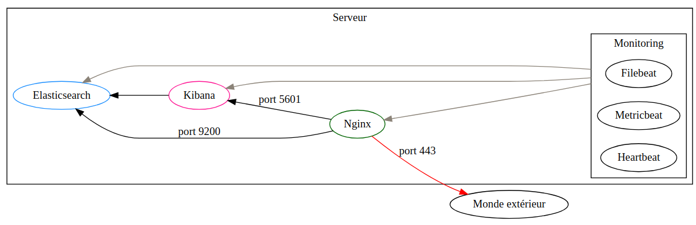
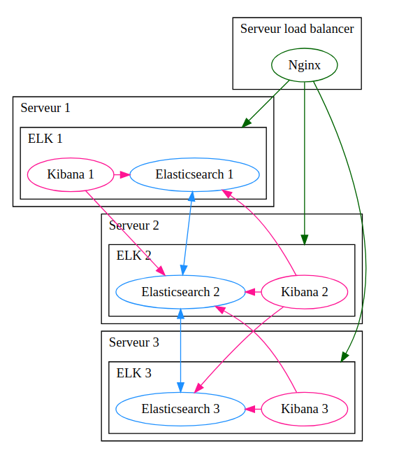

# Architecture de l'infrastructure

## Architecture des composants d'un serveur

Dans chaque serveur, les logiciels suivants sont installés:

**Pour les éléments principaux**:

- [Elasticsearch](https://www.elastic.co/fr/elasticsearch/): base de données NoSQL, avec moteur de recherche distribué
- [Kibana](https://www.elastic.co/fr/kibana/): interface web pour la visualisation des données Elasticsearch
- [Nginx](https://www.nginx.com/): Serveur web haute performance

**Pour les outils de monitoring**:

- [Filebeat](https://www.elastic.co/fr/beats/filebeat): Agent de transfert de logs
- [Metricbeat](https://www.elastic.co/fr/beats/metricbeat): Agent de collecte de métriques
- [Heartbeat](https://www.elastic.co/fr/beats/heartbeat): Moniteur de surveillance (http, tcp, ...)

Les **flux de communications** sont comme indiqué sur le schéma ci-dessous: 

Seuls Elasticsearch et Nginx sont accessibles depuis l'extérieur du serveur.

## Architecture globale et interconnexion des composants

En plus de l'échelle individuelle, nous devons considérer l'architecture globale, car celle-ci est très interconnectée.

- Les différents **noeuds Elasticsearch** forment un clusteur 3 noeuds, avec une tolérance de faute à n - 1
    - Si nous perdons un noeud, le cluster reste fonctionnel
- Les 3 **instances Kibana** sont toutes configurées pour communiquer avec **chacun des noeuds** elasticsearch
    - Tant qu'une instance est fonctionnelle, nous pourrons visualiser les données
- Les 3 **instances Nginx** sont configurées en tant que de [proxy inverse](https://frwikipedia.org/wiki/Proxy_inverse) et [répartiteur de charge](https://fr.wikipedia.org/wiki/R%C3%A9partition_de_charge) pour les instances Kibana et Elasticsearch. Cela signifie que si une des instances Kibana, une autre prendra le relais, et cela transparents pour l'utilisateur. Il en est de même pour Elasticsearch.

Ci dessous un schéma simplifié de l'architecture (certaines flèches sont manquantes, pour gagner en clarté):

## URLs

Pour les URLs, vous pouvez **utilisez les urls dessous**, il s'agit des instances, derrière le load-balancer Nginx.

**Kibana**:
- https://kibana.bd71.transrian.fr

**Elasticsearch**:
- https://elasticsearch.bd71.transrian.fr