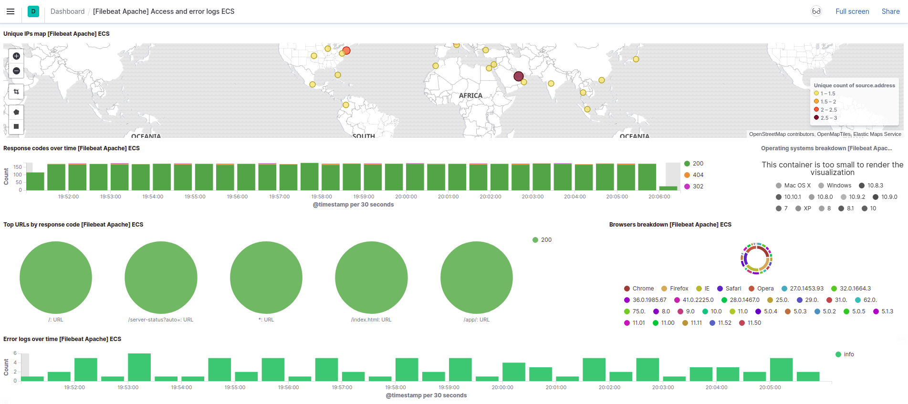
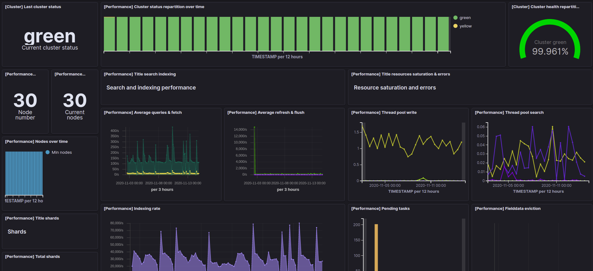

# Qu'est-ce qu'une log ?

## Définition simplifiée

```
Servers executing on Internet hosts produce log records as part of
their normal operations.  Some log records are, in essence, a summary
of an application-layer protocol data unit (PDU) that captures, in
precise terms, an event that was processed by the server.  These log
records serve many purposes including analysis and troubleshooting.
```

*Citation de la RFC6872, définissant le Common Log Format (CLF)*

Une log (ou français "journal") se présente sous la **forme d'un fichier texte** classique, reprenant de façon *chronologique*, l'ensemble des **événements** qui ont affecté un système informatique (logiciel, application, serveur, etc...) et l'**ensemble des actions** qui ont résulté de ces événements.

En informatique, il en existe dans tous les domaines, pour de nombreux uses-cases (exemple d'une infime partie de ceux-ci):

- **serveur**:
    - authentification
    - commandes passées
    - trace des logiciels
- **application web**:
    - appel des pages
    - connexion
    - communication avec les microservices
- **application**:
    - actions effectuées
    - trace des sous-process
    - suivis des écritures fichiers
- **réseaux**:
    - accès
    - trames
    - connexion / déconnexion de périphériques
- **base de données**:
    - accès
    - commandes refusées
    - suivis de performances (ex: Java GC logs)

Dans un **système d'information**, quel que soit sa taille, les éléments qui le composent **génère tous** des logs, permettant à leur gestionnaire d'être sûr de leur bon fonctionnement, ou afin de leur permettre d'identifier les problèmes potentiels.

## Exemple de génération d'une log

Est-ce difficile à faire ? Un exemple ci-dessous, en python:

```python
import logging

logging.basicConfig(format="%(asctime)s - %(name)s - %(process)d - %(filename)s - %(levelname)s - %(message)s")

logging.info("Hello World!")
```

Nous donnera un résultat comme ceci:

```elixir
2021-02-19 19:38:54,290 - root - 12730 - example_logging.py - INFO - Hello World!
```

Contenant:

- La date de génération du message
- L'utilisateur ayant lancé le script
- Le PID du processus
- Le nom du fichier
- Le log level
- Le message en lui-même

C'est beaucoup plus détaillé qu'un simple `Hello World!`, non ?

## Type de log

Tout comme [les données](https://www.datamation.com/big-data/structured-vs-unstructured-data/), les logs peuvent être catégorisés de trois manières distinctes:

- structurées
- semi-structurées
- non structurées

### Exemples de logs

#### Structurée

Une log structuré possède un schéma bien défini.

**Apache combined log format**

```elixir
83.149.9.216 - - [17/May/2015:10:05:03 +0000] "GET /presentations/logstash-monitorama-2013/images/kibana-search.png HTTP/1.1" 200 203023 "http://semicomplete.com/presentations/logstash-monitorama-2013/" "Mozilla/5.0 (Macintosh; Intel Mac OS X 10_9_1) AppleWebKit/537.36 (KHTML, like Gecko) Chrome/32.0.1700.77 Safari/537.36"
```

**Web JSON logging**

```json
{
  "referrer": "\"http://semicomplete.com/presentations/logstash-monitorama-2013/\"",
  "@timestamp": "2021-02-17T08:07:01.738Z",
  "bytes": 203023,
  "message": "83.149.9.216 - - [17/May/2015:10:05:03 +0000] \"GET /presentations/logstash-monitorama-2013/images/kibana-search.png HTTP/1.1\" 200 203023 \"http://semicomplete.com/presentations/logstash-monitorama-2013/\" \"Mozilla/5.0 (Macintosh; Intel Mac OS X 10_9_1) AppleWebKit/537.36 (KHTML, like Gecko) Chrome/32.0.1700.77 Safari/537.36\"",
  "@version": "1",
  "clientip": "83.149.9.216",
  "agent": "\"Mozilla/5.0 (Macintosh; Intel Mac OS X 10_9_1) AppleWebKit/537.36 (KHTML, like Gecko) Chrome/32.0.1700.77 Safari/537.36\"",
  "verb": "GET",
  "response": 200,
  "timestamp": "2015-05-17T10:05:03.000Z",
  "auth": "-",
  "httpversion": 1.1,
  "request": "/presentations/logstash-monitorama-2013/images/kibana-search.png",
  "host": "localhost",
  "ident": "-"
}
```

**Web Clé-valeur**:

```elixir
referrer="\"http://semicomplete.com/presentations/logstash-monitorama-2013/\"" timestamp="2021-02-17T08:07:01.738Z" bytes=203023 message="83.149.9.216 - - [17/May/2015:10:05:03 +0000] \"GET /presentations/logstash-monitorama-2013/images/kibana-search.png HTTP/1.1\" 200 203023 \"http://semicomplete.com/presentations/logstash-monitorama-2013/\" \"Mozilla/5.0 (Macintosh; Intel Mac OS X 10_9_1) AppleWebKit/537.36 (KHTML, like Gecko) Chrome/32.0.1700.77 Safari/537.36\"" version="1" clientip="83.149.9.216" agent="\"Mozilla/5.0 (Macintosh; Intel Mac OS X 10_9_1) AppleWebKit/537.36 (KHTML, like Gecko) Chrome/32.0.1700.77 Safari/537.36\"" verb="GET" response=200 timestamp="2015-05-17T10:05:03.000Z" auth="-" httpversion=1.1 request="/presentations/logstash-monitorama-2013/images/kibana-search.png" host="localhost" ident="-"
```

#### Semi-structurée

Une partie de la log est structurée, mais une autre ne l'es pas!

**Curator**

```elixir
2019-06-03 05:30:10,792 INFO      Trying Action ID: 1, "forcemerge": Perform a forceMerge on selected indices to 'max_num_segments' per shard
2019-06-03 05:30:17,108 INFO      forceMerging index heartbeat-6.5.1-2019.05.23 to 1 segments per shard.  Please wait...
```

> La ligne commence par une date, une heure, et un log level, mais le reste de la log est une phrase

#### Non structurée

Aucune structure visible.

**Redis**

```elixir
SYNC append only file rewrite performed
AOF rewrite: 1 MB of memory used by copy-on-write
Residual parent diff successfully flushed to the rewritten AOF (0.00 MB)
Background AOF rewrite terminated with success
Concatenating 0.00 MB of AOF diff received from parent.
```

## Quel est l'utilité des Logs ?

Visualiser:

- les erreurs
- les actions utilisateurs
- les authentifications
- les [KPIs](https://fr.wikipedia.org/wiki/Indicateur_cl%C3%A9_de_performance)
- les problèmes de sécurité
- ...

Ci-dessous deux exemples en images, plus parlants:



*Une dashboard, basée sur les logs d'un serveur web*


*Une dashboard, basée sur les logs et métriques d'un clusteur Elasticsearch*