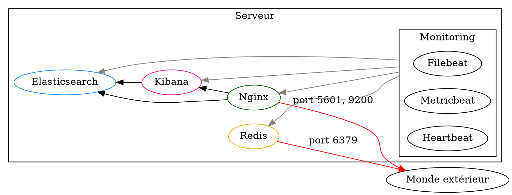
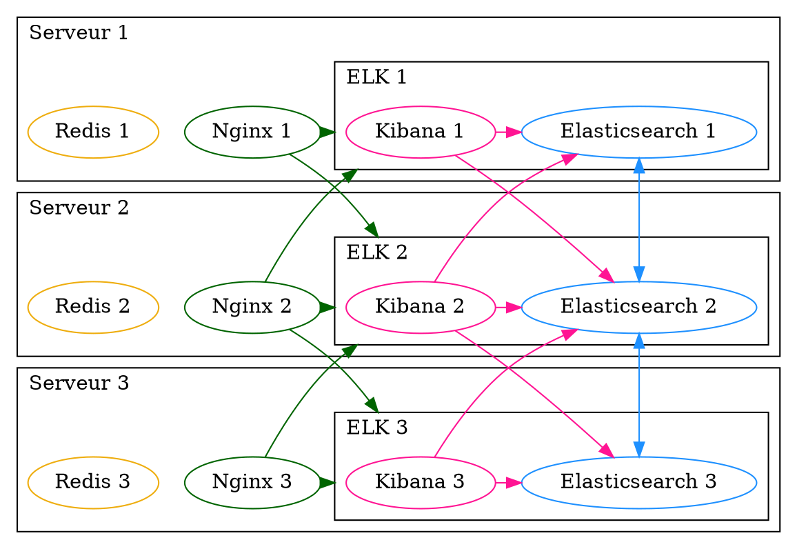
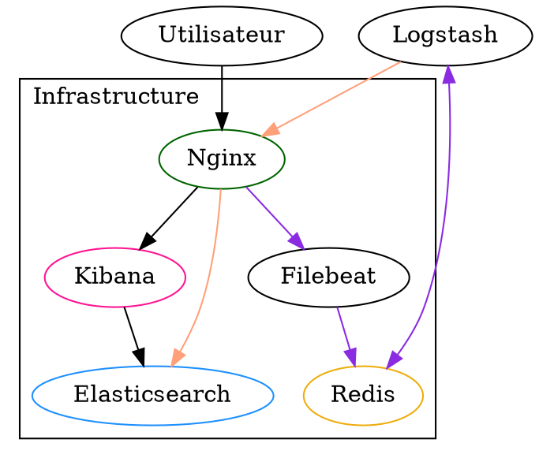
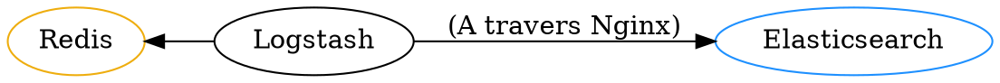

# Schemas

## Zoom on one server

```dot {engine="dot"}
digraph f {  
    rankdir=RL;
    compound=true;

    "Kibana" -> "Elasticsearch"
    "Nginx" -> "Kibana"
    "Nginx" -> "Elasticsearch"
    "Monde extérieur"
    "Monde extérieur" -> "Nginx" [label="port 5601, 9200", color=red, dir="back"]
    "Monde extérieur" -> "Redis" [label="port 6379", color=red, dir="back"]
    "Filebeat" -> "Elasticsearch" [constraint=true, ltail=cluster_monitoring, color=antiquewhite4]
    "Filebeat" -> "Kibana" [constraint=true, ltail=cluster_monitoring, color=antiquewhite4]
    "Filebeat" -> "Nginx" [constraint=true, ltail=cluster_monitoring, color=antiquewhite4]
    "Filebeat" -> "Redis" [constraint=true, ltail=cluster_monitoring, color=antiquewhite4]

    subgraph cluster_server {
        label="Serveur"
        "Elasticsearch" [color=dodgerblue1]
        "Kibana" [color=deeppink]
        "Nginx" [color=darkgreen]
        "Redis" [color=darkgoldenrod2]

        subgraph cluster_monitoring {
            label="Monitoring"
            "Filebeat"
            "Metricbeat"
            "Heartbeat"
        }
        
    }
    
}
```

## Global infrastructure schema

```dot {engine="dot"}
digraph f {  
    compound=true

    "Elasticsearch 1" -> "Elasticsearch 2" [dir=both, color=dodgerblue1]
    "Elasticsearch 2" -> "Elasticsearch 3" [dir=both, color=dodgerblue1]
    "Kibana 1" -> "Elasticsearch 1" [constraint=false, color=deeppink]
    "Kibana 2" -> "Elasticsearch 1" [constraint=false, color=deeppink]
    "Kibana 1" -> "Elasticsearch 2" [constraint=false, color=deeppink]
    "Kibana 2" -> "Elasticsearch 2" [constraint=false, color=deeppink]
    "Kibana 3" -> "Elasticsearch 2" [constraint=false, color=deeppink]
    "Kibana 2" -> "Elasticsearch 3" [constraint=false, color=deeppink]
    "Kibana 3" -> "Elasticsearch 3" [constraint=false, color=deeppink]
    "Nginx 1" -> "Kibana 1" [constraint=false, color=darkgreen, lhead="cluster_elk_server_1"]
    "Nginx 2" -> "Kibana 1" [constraint=false, color=darkgreen, lhead="cluster_elk_server_1"]
    "Nginx 1" -> "Kibana 2" [constraint=false, color=darkgreen, lhead="cluster_elk_server_2"]
    "Nginx 2" -> "Kibana 2" [constraint=false, color=darkgreen, lhead="cluster_elk_server_2"]
    "Nginx 3" -> "Kibana 2" [constraint=false, color=darkgreen, lhead="cluster_elk_server_2"]
    "Nginx 2" -> "Kibana 3" [constraint=false, color=darkgreen, lhead="cluster_elk_server_3"]
    "Nginx 3" -> "Kibana 3" [constraint=false, color=darkgreen, lhead="cluster_elk_server_3"]

   subgraph cluster_server_1 {
        label="Serveur 1"
        labeljust="l"
        "Kibana 1" [color=deeppink]
        "Nginx 1" [color=darkgreen]
        "Redis 1" [color=darkgoldenrod2]
        "Elasticsearch 1" [color=dodgerblue1]

        subgraph cluster_elk_server_1 {
            label="ELK 1"
            "Kibana 1"
            "Elasticsearch 1"
        }
    }

    subgraph cluster_server_2 {
        label="Serveur 2"
        labeljust="l"
        "Kibana 2" [color=deeppink]
        "Nginx 2" [color=darkgreen]
        "Redis 2" [color=darkgoldenrod2]
        "Elasticsearch 2" [color=dodgerblue1]

        subgraph cluster_elk_server_2 {
            label="ELK 2"
            "Kibana 2"
            "Elasticsearch 2"
        }
    }

    subgraph cluster_server_3 {
        label="Serveur 3"
        labeljust="l"
        "Kibana 3" [color=deeppink]
        "Nginx 3" [color=darkgreen]
        "Redis 3" [color=darkgoldenrod2]
        "Elasticsearch 3" [color=dodgerblue1]

        subgraph cluster_elk_server_3 {
            label="ELK 3"
            "Kibana 3"
            "Elasticsearch 3"
        }
    }

    #{rank=same; "Serveur 1"; "Serveur 2"; "Serveur 3";}


}
```

## Buffered reader schema

```dot {engine="dot"}
digraph f {
    compound=true;

    "Kibana" -> "Elasticsearch"
    "Nginx" -> "Kibana"

    "Nginx" -> "Filebeat" [color=blueviolet]
    "Filebeat" -> "Redis" [color=blueviolet]

    "Utilisateur" -> "Nginx"

    "Logstash" -> "Redis" [dir="both", color=blueviolet]
    "Logstash" -> "Nginx" [color=lightsalmon1]
    "Nginx" -> "Elasticsearch" [color=lightsalmon1]

    subgraph cluster_server {
        label="Infrastructure"
        labeljust="l"
        "Elasticsearch" [color=dodgerblue1]
        "Kibana" [color=deeppink]
        "Nginx" [color=darkgreen]
        "Redis" [color=darkgoldenrod2]
        "Filebeat"
        
    }
    
}
```

## Buffered reader schema short

```dot {engine="dot"}
digraph f {
    rankdir=LR;

    "Elasticsearch" [color=dodgerblue1]
    "Redis" [color=darkgoldenrod2]

    "Redis" -> "Logstash" [dir=back]
    "Logstash" -> "Elasticsearch" [label="(A travers Nginx)"]
    
}
```