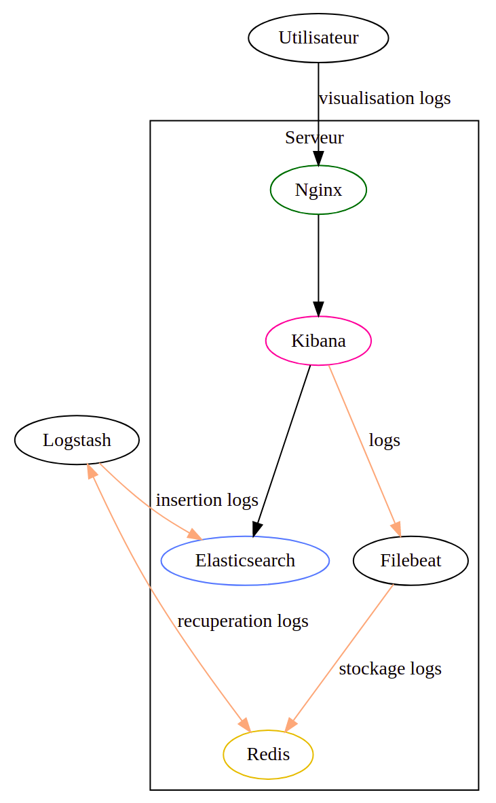

# TP 2 (2h)

**Collecte et traitement de logs en temps réel.**

**TLDR**: Avec Logstash, nous allons lire des données depuis Redis, générées en temps réel, les traiter, les envoyer dans Elasticsearch, et faire un dashboard de suivis.

## Architecture

Prendre dans un premier temps connaissance de [l'architecture complète de l'infrastructure Elasticsearch](/general/architecture.md)

Pour résumer:

- Un **clusteur Elasticsearch** trois noeuds va nous servir de base de donnée
- Trois **Kibana** vont nous permettre de faire des dashboards, depuis les données Elasticsearch
  - Le sinstances Elasticearch et Kibana ne seront pas accessibles depuis l'extérieur -> vous ne pourrez pas communiquer directement avec eux
- Des **Nginx**, configurés en tant que Load Balancer & Reverse Proxy, vont faire le [pont](https://fr.wikipedia.org/wiki/Pont_(r%C3%A9seau)) entre le réseaux internes des machines, et l'extérieur (vos machines)

A partir de l'infrastructure actuelle, voici-ce que nous allons **réaliser**:



- flux violet, **récupération des logs de Nginx** avec un filebeat (déjà fait), et stocker dans un Redis
- Récupération de ces logs depuis Redis avec un Logstash (à faire), **parsing**, et envoie dans Elasticsearch (en transitant par Nginx, flux orange)
- Enfin, le client final, vous, pourras **visualiser les logs** en temps réel, depuis Kibana (flux noir)

## Notions fondamamentales pour Elasticsearch

Un **index** est un endroit où nous pouvons stocker des données. Beaucoup d'entre-elles. Cela équivaut, pour du SQL, à une **table**.

### Shards

Il est caractérisé par deux caractéristiques principales:
- un nombre de **shards** : un nombre de **partitions**, dans laquelle il stocke les données
- un nombre de **réplicas** : le nombre de fois qu'un **shard** à une backup

Même si ce n'est pas une limitation au sens strict du term, un **shard** doit avoir une taille maximale compris entre 20-40Go pour des performances optimales. Et plus il y a de shards, plus les performances en écriture et lecture sont meilleurs.

Par exemple, si nous voulons **stocker 120Go de données**, pour un **seul index**, avec un nombre de réplicas à 1 (=1 backup par shard), nous pouvons faire:
- 1 shard, taille maximale 120Go
- 2 shard, taille maximale 60Go
- 4 shard, taille maximale: 30Go

Pour notre clusteur 3 noeuds, comme le ratio idéal shard - nombre de noeuds est de 1, nous allons avoir **3 shards par index**.

### Cycle de vie des données

Mais comment faire pour gérer le cycle de vie d'une donnée alors ? Si nous voulons stocker 1000Go pour 30j de données ?

Avec Elasticsearch, nous avons deux moyens:
- générer des indexs, avec un **postfix temporel** (par mois, jour, etc..). Par exemple:
  - mon_index-2021.05
  - mon_index-2021.05.02
- avec [ILM](https://www.elastic.co/guide/en/elasticsearch/reference/current/index-lifecycle-management.html)(Index Lifecycle Policy) : Elasticsearch va **gérer lui-même** quand créer un nouvel index, à partir des paramètres que vous aurez préalablement définis (nous verrons cela plus tard). Par exemple:
  - mon_index-000001
  - mon_index-000002
  - mon_index-000003
  - ..

### Alias

Pour intéroger plusieurs index, que ce soit à travers Kibana, ou à travers les APIs, nous avons deux choix:
- utiliser un **pattern**, avec des wildcard (comme pour les chemin de fichier linux). L'exemple d'index précédent donnerais le pattern `mon_index-*` (que ce soit avec le postfix temporel, ou ILM)
- créer un **alias**, qui est l'équivalent SQL d'une vue, et qui va permettre d'intéroger plusieurs indexs

### Template

Les templates sont une notion très importante dans Elasticsearch. Ils vont permettre de définir, **avant** la création des **index**, certaines de leurs caractéristiques.

Par exemple:

- le **nombre de shards** d'un index
- le **nombre de replicas** d'un index
- la **localisation** d'un index (dans le cadre d'une architecture hot / warm / cold)
- le [mapping](https://www.elastic.co/guide/en/elasticsearch/reference/current/mapping.html) des **champs** : la définition de leurs types, et caractéristiques (nécessaire, dans certains cas)

## Accès de Kibana et Elasticsearch

*(Valable pour tous les TPs)*

Même si l'accès à Kibana et Elasticsearch est en SSL, l'accès sera **authentifié**.

Chaque groupe à donc un utilisateur créer, avec pour username / password le couple `groupeX/groupeX`.

> Pour le Groupe 3, user/mdp sera groupe3/groupe3

Des exemples d'url (présent sur chaque noeuds), cf. page d'architecture globale:
- **Elasticsearch**: https://serv-bd71-1:9200
- **Kibana**: https://serv-bd71-1:5601

Comme vous ne serez pas admin sur le cluster Elasticsearch, vos droits sont restreints:
- nous ne **verrez pas toutes les données** (seulement les votres, ainsi que quelques-unes génériques)
- vous n'**aurez pas accès** à toutes fonctionnalités Kibana

Vous pourrez **créer, lire, détruire** les données associés à votre nom de groupe, dans les **index** respectant le **pattern** suivant: `<groupeX>-*`

Par exemple, cela signifie, **pour le groupe 3**:
- il **pourra accéder** ou créer l'index `groupe3-test`
- il **ne pourra pas accéder** ou créer les index `test` ou `groupe4-test`

Il en est de même pour la création et consultation des **alias**: la différence est qu'ils **doivent-être en majuscule**, par exemple *GROUPE3_ACCESS*

## 1 Ingestion des données dans Elasticsearch

Schéma de ce que nous allons réaliser:


Les logs que nous allons récolter et parser sont celles d'un web serveur [Nginx](https://fr.wikipedia.org/wiki/NGINX), donc très similaires au format **Apache logs** que vous avez déjà traité.

**Redis**, qui va nous servir de **buffer**, possède une **queue**, qui contiendra les logs des serveurs Nginx. Cette clé sera formaté ainsi: `logs-access-<groupX>`

Le but de cette exercice va être d'insérer les données dans **Elasticsearch**, en prenant en compte le **cycle de vie** des données.

### Input & filter Logstash

L'input & le filtre seront **communs** aux deux cas d'usage.

Ils sont accessible sur [cette page](resources/tp-2/logstash_conf.md)

L'**input** est relativement **simple**: 
  - Pour chaque instance Redis (une par serveur), nous avons un input redis, avec les paramètres associé, afin de lire les valeurs dans la **clé** de stockage.
  - Le Redis, à travers cette configuration Logstash, est configuré en tant qu'une [queue FIFO](https://fr.wikipedia.org/wiki/File_(structure_de_donn%C3%A9es)) : les premier évènements rentrés seront les premier récupérer par Logstash

Le **filtre**, quand à lui, est **beaucoup plus complexe**. Même si le format est très similaire aux logs Apache que nous avons vu le TP précédent, il va couvrir certains uses-cases et besoin plus spécifiques:

- couvrir **plusieurs types de format de log web** (apache, apache combined, nginx, traefik)
- **formater les données** en format [Elastic ECS](https://www.elastic.co/guide/en/ecs/current/index.html) : une structuration particulière des évènement, recommandé par Elastic
- Faire une **géolocalisation** du client si possible
- Séparer l'**url** en sous parties, utilisable dans Kibana
- Séparer l'[user agent](https://fr.wikipedia.org/wiki/User_agent) client en plusieurs partie
- Séparer l'[OS](https://fr.wikipedia.org/wiki/Syst%C3%A8me_d%27exploitation) client en plusieurs partie

> N'oublier pas de mettre **votre nom de groupe** dans l'input, dans la **key** Redis!

### 1.1 Insertion dans Elasticsearch basique

Dans un premier temps, nous allons just écrire les données venant de Redis dans un unique index Elasticsearch.

Créer une nouvelle **pipeline Logstash**, et ajouter, en plus de l'input & du filter, l'output suivant.

[resources/tp-2/logstash_output_basic.md](resources/tp-2/logstash_output_basic.md ':include')

Si vous n'avez pas d'erreurs:

- Connecter vous dans Kibana
- Dans le menu, aller dans **Stack Management**, puis dans **Data**, la partie **Index Management**
- **Vérifier** que l'index que vous avez créer **existe** bien, et que **le nombre de documents** n'est pas égal à zéro

Si tout c'est bien passé, après avoir vérifier de la même manière que l'exemple précédent, vous pouvez continuer.

### 1.2 Index journaliers

Maintenant, nous allons configurer Logstash pour qu'il génère **un index par jour**, afin que nos index ne soient pas trop gros.

En cherchant sur Internet, ou sur la page de documentation de l'[output Elasticsearch](https://www.elastic.co/guide/en/logstash/current/plugins-outputs-elasticsearch.html) (mais mal indiqué), essayer de réaliser ça, et tester, en **modifiant l'output** de la pipeline précédente!

> Ne pas utiliser ILM pour cette partie

### 1.3 Index gérés par ILM

Avant de pouvoir configurer Logstash pour utiliser ILM, nous devons créer une policy ILM, ce que nous allons faire, depuis Kibana. Allez dans **Stack Management**, puis dans **Data**, la partie **Index Lifecycle Policy**, et **créer une nouvelle policy**, basé sur les paramèters de l'image ci-dessous (adapter, dans le nom de la policy, votre groupe):


**Cette policy va effectuer**:
- la création d'un nouvel index, si l'ancien à une taille supérieur à 30 Gb, ou à plus de 7 jours. Cette action est appelé un **rollover**.
- la suppression des anciens index, **7 jours** après le rollover. Ce qui signifie que les données allant dans les index resteront stockés pendant **au moins 7 jours**, pour un **maximum de 14 jours**, selon quand est atteinte la policy.

Une fois la policy créer, il est temps de **configurer la sortie Logstash** (vous pouvez vous baser également sur la configuration précédente).

Pour la configuration de l'output Logstash, je vous invite à vous basez (après avoir lu la doc) de cet [exemple](https://www.elastic.co/guide/en/logstash/current/plugins-outputs-elasticsearch.html#plugins-outputs-elasticsearch-ilm), en adaptant le **rollover alias** et la **policy ilm** à votre configuration. Le **rollover alias** va correspondre au préfix de l'index (cf. explications précédente sur le cycle de vie de la données), vous pouvez utiliser `<groupX>-access_ilm`

Après avoir **vérifier** que vous **ayez bien des données**, nous allons faire un brin de **configuration supplémentaire** sur les indexs, avant de passer à la partie la plus importante, la visualisation des données!

### 1.3 Ajout d'Alias sur les index

Pour pouvoir accéder plus facilement aux données, nous allons créer un [alias](https://www.elastic.co/guide/en/elasticsearch/reference/master/indices-aliases.html) sur les index ILMs.

Celà va se traduire en deux phases:
- dans un premier temps, nous allons **créer un index template**, associé à l'index pattern de nos index, qui s'appliquera lors de la **création des nouveaux index**
- dans un second temps, nous allons **appliquer** l'alias sur **le ou les index actuels**, afin de pouvoir l'utiliser immédiatement

Pour mettre en place un template, nous allons nous rendre dans la partie **Dev Tools**, qui va nous permettre d'executer des commandes habituellement accesible par API sur le clusteur Elasticsearch.

Nous allons effectuer la commande suivante (après avoir remplacer les valeurs): 

```json
PUT _template/groupeX_access
{
    "order" : 0,
    "index_patterns" : [
      "groupeX-acces_ilm-*"
    ],
    "settings" : {
      "index" : {
        "number_of_shards" : "3",
        "number_of_replicas" : "1"
      }
    },
    "mappings" : { },
    "aliases" : { 
      "GROUPEX_ACCESS": {}
    }
}
```

Celle-ci **va nous permettre**, pour les nouveaux index se créant, de définir:
- un alias (ici *GROUPEX_ACCESS*)
- un nombre de shards
- un nombre de replicas

Pour appliquer l'**alias** sur nos **index actuels**, rien de plus simple, cette commande suffit:

```
PUT groupe3-access_ilm-*/_alias/GROUPE3_ACCESS
```

Pour **vérifier que notre alias existe désormais**, nous allons faire une recherche, simple, en l'utilisant:

```json
GET GROUPEX_ACCESS/_search
```

Le résultat devrait avoir un nombre de **hit** différent de zéro, et vous pouvez avoir un aperçu des premiers évènements dans le résultat.

> Il est recommandé de **laisser le Logstash fonctionner**, ça vous permettra d'avoir des données en permanence, ce qui sera plus simple pour le TP3

## 2. Question ouvertes

Qui seront discutés au début du tp suivant:

- Quelle est le plus gros désaventage d'ILM ?
- Quel est le problème pour la génération d'index journalier / mensuels, pour un stockage courte durée ?
- Quels sont les paramètres à prendre en compte, pour la création d'index (ILM ou journalier / mensuels), pour une application ?