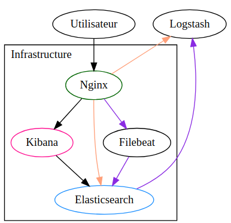

# TP 2

**Collecte et traitement de logs en temps réel.**

**TLDR**: Avec Logstash, nous allons lire des données depuis Redis, générées en temps réel, les traiter, les envoyer dans Elasticsearch, et faire un dashboard de suivis.

## Architecture

Prendre dans un premier temps connaissance de [l'architecture complète de l'infrastructure Elasticsearch](/general/architecture.md)

Pour résumer:

- Un **clusteur Elasticsearch** trois noeuds va nous servir de base de donnée
- Trois **Kibana** vont nous permettre de faire des dashboards, depuis les données Elasticsearch
  - Le sinstances Elasticearch et Kibana ne seront pas accessibles depuis l'extérieur -> vous ne pourrez pas communiquer directement avec eux
- Des **Nginx**, configurés en tant que Load Balancer & Reverse Proxy, vont faire le [pont](https://fr.wikipedia.org/wiki/Pont_(r%C3%A9seau)) entre le réseaux internes des machines, et l'extérieur (vos machines)

A partir de l'infrastructure actuelle, voici-ce que nous allons **réaliser**:

- flux violet, **récupération des logs de Nginx** avec un filebeat (déjà fait), et stocker dans un Redis
- Récupération de ces logs depuis Redis avec un Logstash (à faire), **parsing**, et envoie dans Elasticsearch (en transitant par Nginx, flux orange)
- Enfin, le client final, vous, pourras **visualiser les logs** en temps réel, depuis Kibana (flux noir)

## Notions fondamamentales pour Elasticsearch

Un **index** est un endroit où nous pouvons stocker des données. Beaucoup d'entre-elles. Cela équivaut, pour du SQL, à une **table**.

### Shards

Il est caractérisé par deux caractéristiques principales:
- un nombre de **shards** : un nombre de **partitions**, dans laquelle il stocke les données
- un nombre de **réplicas** : le nombre de fois qu'un **shard** à une backup

Même si ce n'est pas une limitation au sens strict du term, un **shard** doit avoir une taille maximale compris entre 20-40Go pour des performances optimales. Et plus il y a de shards, plus les performances en écriture et lecture sont meilleurs.

Par exemple, si nous voulons **stocker 120Go de données**, pour un **seul index**, avec un nombre de réplicas à 1 (=1 backup par shard), nous pouvons faire:
- 1 shard, taille maximale 120Go
- 2 shard, taille maximale 60Go
- 4 shard, taille maximale: 30Go

Pour notre clusteur 3 noeuds, comme le ratio idéal shard - nombre de noeuds est de 1, nous allons avoir **3 shards par index**.

### Cycle de vie des données

Mais comment faire pour gérer le cycle de vie d'une donnée alors ? Si nous voulons stocker 1000Go pour 30j de données ?

Avec Elasticsearch, nous avons deux moyens:
- générer des indexs, avec un **postfix temporel** (par mois, jour, etc..). Par exemple:
  - mon_index-2021.05
  - mon_index-2021.05.02
- avec [ILM](https://www.elastic.co/guide/en/elasticsearch/reference/current/index-lifecycle-management.html)(Index Lifecycle Policy) : Elasticsearch va **gérer lui-même** quand créer un nouvel index, à partir des paramètres que vous aurez préalablement définis (nous verrons cela plus tard). Par exemple:
  - mon_index-000001
  - mon_index-000002
  - mon_index-000003
  - ..

### Alias

Pour intéroger plusieurs index, que ce soit à travers Kibana, ou à travers les APIs, nous avons deux choix:
- utiliser un **pattern**, avec des wildcard (comme pour les chemin de fichier linux). L'exemple d'index précédent donnerais le pattern `mon_index-*` (que ce soit avec le postfix temporel, ou ILM)
- créer un **alias**, qui est l'équivalent SQL d'une vue, et qui va permettre d'intéroger plusieurs indexs

### Template

Les templates sont une notion très importante dans Elasticsearch. Ils vont permettre de définir, **avant** la création des **index**, certaines de leurs caractéristiques.

Par exemple:

- le **nombre de shards** d'un index
- le **nombre de replicas** d'un index
- la **localisation** d'un index (dans le cadre d'une architecture hot / warm / cold)
- le [mapping](https://www.elastic.co/guide/en/elasticsearch/reference/current/mapping.html) des **champs** : la définition de leurs types, et caractéristiques (nécessaire, dans certains cas)

## Accès de Kibana et Elasticsearch

*(Valable pour tous les TPs)*

Même si l'accès à Kibana et Elasticsearch est en SSL, l'accès sera **authentifié**.

Chaque groupe à donc un utilisateur créer, avec pour username / password le couple `groupeX/groupeX`.

> Pour le Groupe 3, user/mdp sera groupe3/groupe3

Des exemples d'url (présent sur chaque noeuds), cf. page d'architecture globale:
- **Elasticsearch**: https://serv-bd71-1:9200
- **Kibana**: https://serv-bd71-1:5601

## 1.1 Ingestion des données dans Elasticsearch

Schéma de ce que nous allons réaliser:

fds