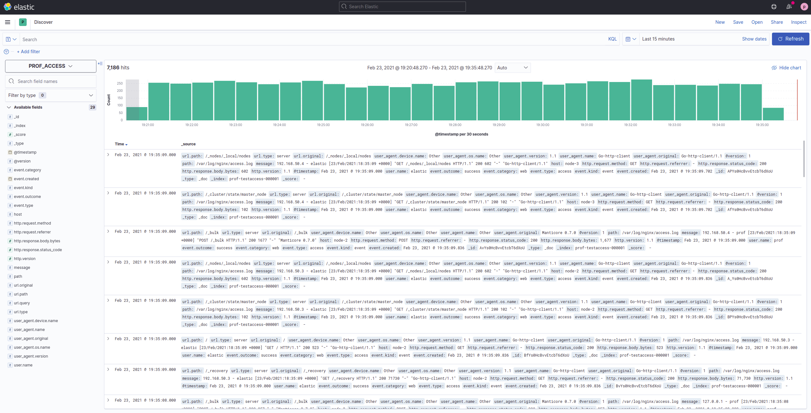

# Prise en main de Kibana

Maintenant que nous avons vu les **bases de l'ingestion de données** dans Elasticsearch, nous allons étudier la partie la plus intéressante, la **visualisation de données**!

Mais dans un premier temps, il va falloir comprendre le **fonctionnement** de Kibana.

## Composants

### Index pattern

*(Stack Management > Kibana > Index patterns)*

Un **index pattern**, dans Kibana, est la **représentation** de la *structure* de nos évènements. Il est associé à un ou plusieurs **index** Elasticsearch ou **alias**, et va synthétiser les différents champs, leur types, ansi que l'affichage que nous allons en faire dans Kibana.

Lors de la **définition** d'un index pattern, il faut définir, si possible, un **champ de type date**, la *date principale*, correspondant à la date de génération des données. Elle va permettre à Kibana, lorsque nous allons réaliser des visualisations, de savoir quelle champ utiliser, pour certains types de visualisations (eg. histogrammes)

Prenons par exemple cet index pattern:

Nous pouvons voir:
- la majorité des champs sont de type **string**
- certains autres **types de champs** existent aussi, comme **ip**, **number**, **geopoint**
- pour tous les champs **string**, il existe un champ **.keyword**
    - le champ sans *.keyword* n'est **pas agrégable** -> il est uniquement utile lorsque nous allons faire des recherche de text dans son contenu
    - le champ avec *.keyword* **est aggrégable** -> nous allons l'utiliser principalement lors des **aggrégations**, dans les différentes visualisations Kibana.

Même si nous ne pouvons **pas modifier leur contenu** directement, nous pouvons modifier, à travers l'interface, la **manière** dont le champs sera **affiché** dans l'interface. Si nous prenons example d'un champs sous format nombre (alors qu'il s'agit en réalité de bytes), nous allons être capable de le définir pour le champ en question, comme dans la capture suivante:

### Visualisations

Les visualisations sont les **briques** essentiels à la représentation visuelles des données, et chaque visualisation va contenir une ou plusieurs métriques.

Pour **créer** une nouvelle visualisation, nous allons aller, dans le menu, dans la partie **Analytics**, puis **Visualize**.

Nous allons avoir 5 catégories principales, et 2 annexes:

- **Lens**: que nous allons utiliser quasiment exclusivement, et qui permet de mettre en forme facilement ses données
- **Maps**: Faire des cartes (si nous avons des données adaptées)
- **TSBD**: Une alternative de *Lens* pour faire des visualisations
- **Custom visualization**: Créer des visualisation en partant de zéro, en faisant du code html / css
- **Aggregation based** (et toutes ses sous-catégories): Toutes les types de visualisations, utilisé de manière historique dans Kibana (**Lens** est appararu fin 2020)

#### Lens

Toute les visualisations qui seront réalisés dans ce TP seront réalisé avec **Lens**

Il va permettre de faire changer facilement de type de visualisation, ce qui s'averreras très pratique, comme vous pourrez le voir.

12 types de visualisations sont accessibles:

Ces différents types de visualisations sont les suivants:

- **Bar**: Affichage de métriques sous forme de barres
- **Horizontal bar**: Même choses, mais de manière horizontal
- **Stacked bar**: Les barres sont empilées, lorsque nous faison un *split*
- **Percentage bar**: Affiche une répartition de la métrique, en fonction du *split* que nous réalisons
- **Area**: Affichage de métriques sous formes d'aires
- **Stacked area**: Affichage de métriques sous formes d'aires empilées
- **Percentage area**: Affiche une répartition de la métrique, en fonction du *split* que nous réalisons
- **Line**: Affichage de métriques sous forme de lignes
- **Data table**: Affichage de données sous la forme de tableau
- **Metric**: Affichage d'un seul métrique, sous forme numérique
- **Donut**: Diagramme circulaire creux
- **Pie**: Diagramme circulaire
- **Treemap**: [Carte proportionelle](https://fr.wikipedia.org/wiki/Treemap)

L'interface de création d'une visualisation lens est la suivante:

On peux voir:
- Sur la gauche:
    - en haut: Le nom de notre index pattern
    - la **liste de nos champs**, présent dans notre index pattern, que nous pouvons utiliser. L'**îcone** à côté de leur nom représente leur **type**
- Au centre:
    - en haut: le changement de type de visualisation
    - le panneau principal, sur lequel nous verrons apparaitre le visualisation en elle-même
- A droite, **la partie la plus importante** (les champs vont **dépendre du type** de visualisation):
    - En haut, nous pouvons **changer l'index pattern** utilisé
    - Ensuite, nous allons pouvoir choisir notre **axe horizontal**. Pour des données temporel, nous utiliserons principalement les **champs de type date**
    - Puis, choisir la ou les **métriques** à afficher. Cela peut être un simple **comptage des évènements**, une **moyenne d'un champs numérique**, un filtre en fonction de valeurs de champs, etc.
    - Enfin, nous allons pouvoir **séparer** la série temporelle, en fonction d'un champs.
        
Si nous prenons un exemple concret : l'affichage du nombre d'évènement par serveur, cela nous donnerais quelque chose comme ça:

Les valeurs choisis sont les suivantes :
- **Axe horizontal**: le champs correspondant à la **date de l'évènement**, car nous voulons voir une évolution dans le temps
- **Axe vertical**: Un simple **comptage d'évènement**
- **Séparation des séries**: En fonction du serveur source (nous en avons trois, nous voulons voir si un est plus solicité qu'un autre)

Le **fonctionnement** global de Lens est similaire pour **tous les types** de visualisations (même si pour certains, comme les **Pies**, il n'y a pas d'axe horizontal)

### Discover

La partie **Discover** (Analytics > Discover) va nous permettre d'avoir l'accès à toutes nos données, et de faire des recherches sur celles-ci.

Son interface ressemble à ça:

En haut, dans la barre de **search**, nous allons pouvoir effectuer des recherches, soit en langage [Lucene](https://www.elastic.co/guide/en/kibana/current/lucene-query.html), ou en langage [KQL](https://www.elastic.co/guide/en/kibana/7.11/kuery-query.html)

Nous pouvons également ajouter des **filtres**:
    - soit en haut, sous la partie recherche
    - soit sur la gauche, en sélectionnant un champs, et en filtrant sur une valeur

Et nous allons également pouvoir **changer l'affichage** de la fenètre des évènements, en ajoutant des champs (le **+**, lorsque nous passons sur le champ). Cette même fenètre, une fois quelques filtres ajoutés:

Il est possible de **sauvegarder** cette disposition personnalisé, et c'est ce qui nous permettra, une fois sauvegardé, le l'intégré dans nos **dashboard**

Dans les deux cas, nous pouvoir voir le **contenu des évènements**, en cliquant sur le caractère inférieur `>`, à gauche de chaque évènements

### Dashboard

Les dashboards (Analytic > Dashboard) sont les **élements centraux de visualisations de nos données**, et seront ce que nous utiliserons, pour avoir un aperçu des différents **KPIs** et **métriques** de nos systèmes et applications.

Après en avoir créer une, nous allons pouvoir ajouter nos **visualisations** et **saved searched**(sauvegarde du discover), afin de créer une **vue complète** de notre système.

Il est possible de les **redimentionner**, **déplacer**, **modifier**, afin d'avoir une interface la plus simple & efficace possible, pour la surveillance d'un système.

Ci-dessous un exemple de dashboard, en mode édition:

Tout en **haut** se trouve une partie très importante : la zone de **séléction temporelle**. C'est là que nous allons configurer, pour l'ensemble de nos visualisations, la **période** sur laquelle nous regardons nos données, et la **fréquence de raffraichissement** (si les données arrivent en temps réel).

Quasiment tous les éléments et métriques des visualisation sont **cliquable**, et vont permettre de mettre en place des **filtres** globaux, appliqués sur l'ensemble de nos dashboard. 

## 1. Dashboard de suivis des logs web

Pour **créer une dashboard**, plusieurs éléments sont impliqués:
- Un **index pattern Kibana**, qui va correspondre aux données utilisées. Comme nous venons de mettre en place un **alias**, nous l'utiliserons pour créer le pattern
- Des **visualisations**, qui correspondent à un élément unique
- Des **saved search**, qui correspondent à une **vue** des logs
- Enfin, les **dashboards** en elles-mêmes, qui **regroupent** des visualisations & saved-search

Pour créer un **index pattern Kibana**, allez dans Stack Management > Kibana > Index Patterns, et:
- Créer en un nouveau
- L'**Index pattern name** correspond au nom des indexes ou alias, nous allons donc entrer notre alias précédement créer, **GROUPEX_ACCESS**)
- Le **time field** correspond au champs date utilisé par défaut dans toutes les visualisations : dans notre cas, le champs date correspondant à la génération de l'évènement s'apelle `@timestamp`

Une fois créer, vous pouvez **aller** dans la partie **Discover** de Kibana, ou vous verrez vos logs!

Ci-dessous un exemple de ce que vous devriez voir:

TODO