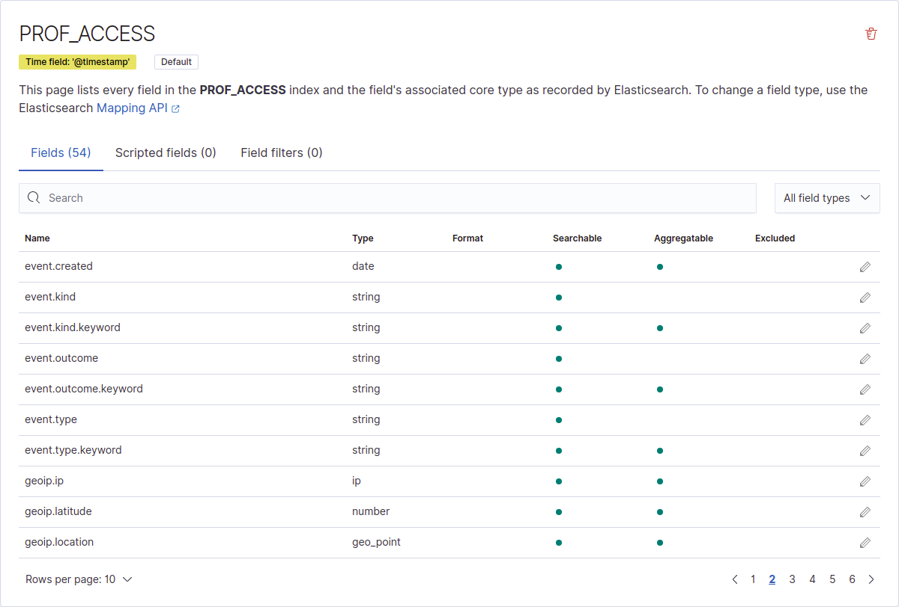
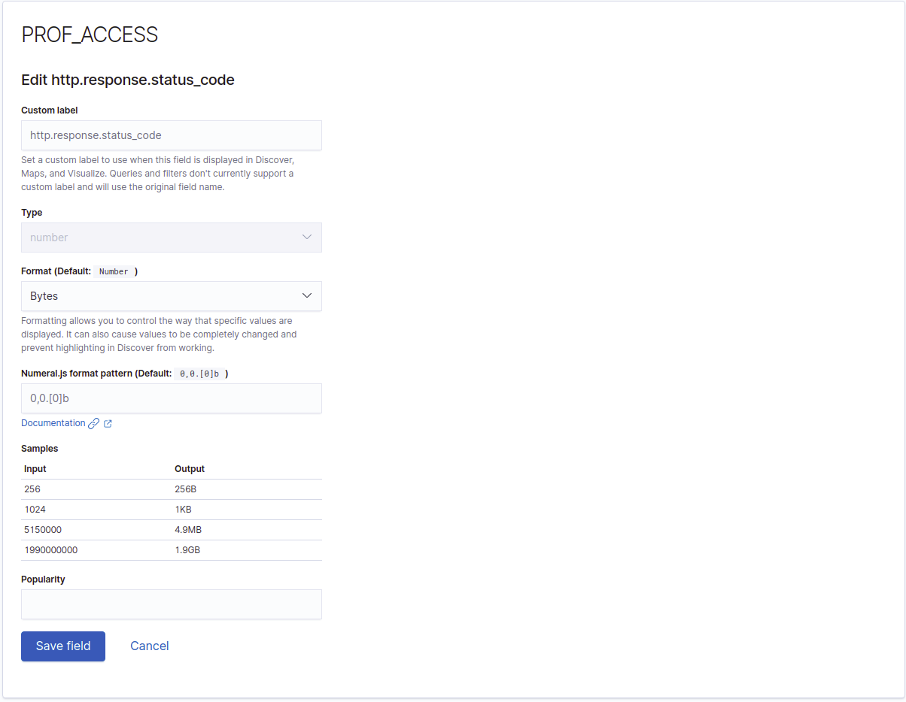
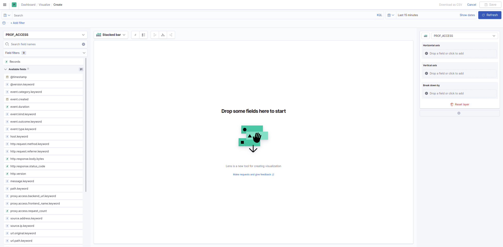
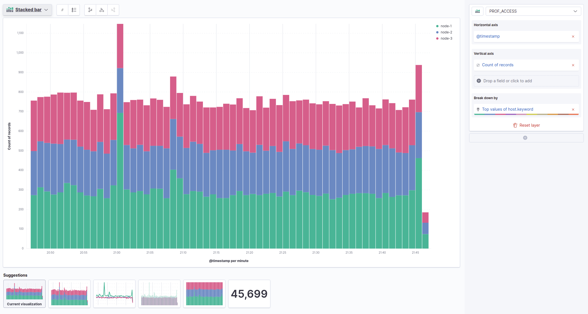
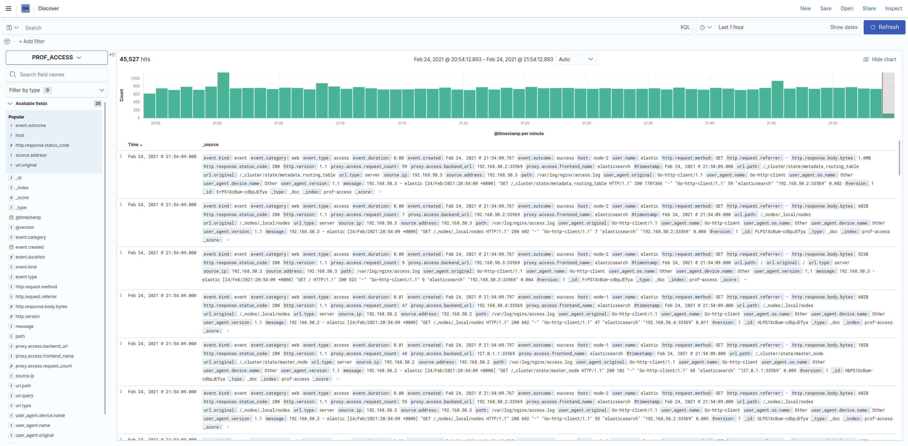
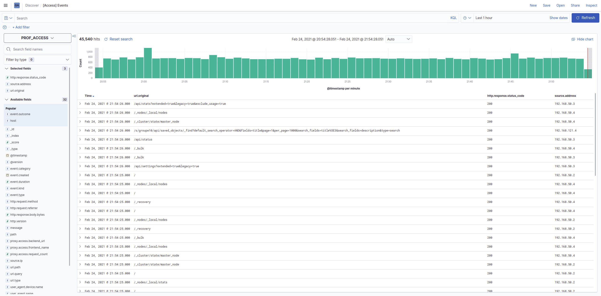
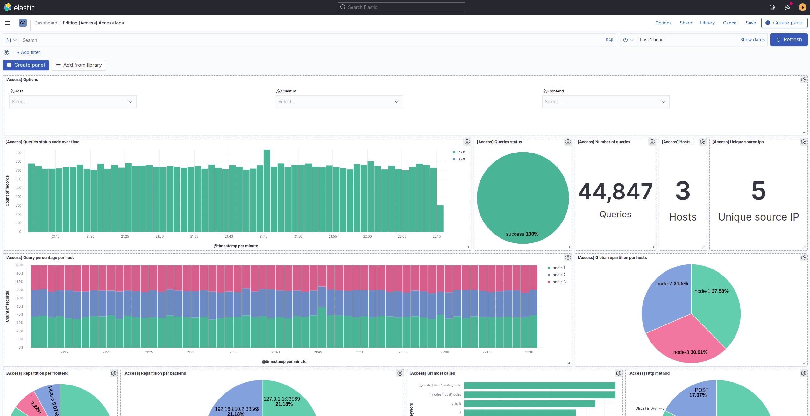
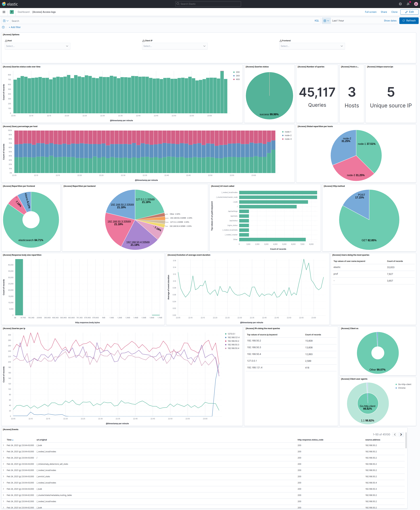

# Prise en main de Kibana (2h)

Maintenant que nous avons vu les **bases de l'ingestion de données** dans Elasticsearch, nous allons étudier la partie la plus intéressante, la **visualisation de données**!

Mais dans un premier temps, il va falloir comprendre le **fonctionnement** de Kibana.

## Composants

### Index pattern

*(Stack Management > Kibana > Index patterns)*

Un **index pattern**, dans Kibana, est la **représentation** de la *structure* de nos évènements. Il est associé à un ou plusieurs **index** Elasticsearch ou **alias**, et va synthétiser les différents champs, leurs types, ainsi que l'affichage que nous allons en faire dans Kibana.

Lors de la **définition** d'un index pattern, il faut définir, si possible, un **champ de type date**, la *date principale*, correspondant à la date de génération des données. Elle va permettre à Kibana, lorsque nous allons réaliser des visualisations, de savoir quel champ utiliser, pour certains types de visualisations (ex. histogrammes)

Prenons par exemple cet index pattern:

Nous pouvons voir:
- la majorité des champs sont de type **string**
- certains autres **types de champs** existent aussi, comme **ip**, **number**, **geopoint**
- pour tous les champs **string**, il existe un champ **.keyword**
    - le champ sans *.keyword* n'est **pas agrégable** -> il est uniquement utile lorsque nous allons faire des recherches de texte dans son contenu
    - le champ avec *.keyword* **est aggrégable** -> nous allons l'utiliser principalement lors des **aggrégations**, dans les différentes visualisations Kibana.

Même si nous ne pouvons **pas modifier leur contenu** directement, nous pouvons modifier, à travers l'interface, la **manière** dont le champ sera **affiché** dans l'interface. Si nous prenons exemple d'un champ sous format nombre (alors qu'il s'agit en réalité de bytes), nous allons être capable de le définir pour le champ en question, comme dans la capture suivante:

### Visualisations

Les visualisations sont les **briques** essentielles à la représentation visuelle des données, et chaque visualisation va contenir une ou plusieurs métriques.

Pour **créer** une nouvelle visualisation, nous allons aller, dans le menu, dans la partie **Analytics**, puis **Visualize**.

Nous allons avoir 5 catégories principales, et 2 annexes:

- **Lens**: que nous allons utiliser quasiment exclusivement, et qui permet de mettre en forme facilement ses données
- **Maps**: Faire des cartes (si nous avons des données adaptées)
- **TSBD**: Une alternative de *Lens* pour faire des visualisations
- **Custom visualization**: Créer des visualisations en partant de zéro, en faisant du code html / css
- **Aggregation based** (et toutes ses sous-catégories): Toutes les types de visualisations, utilisés de manière historique dans Kibana (**Lens** est apparu fin 2020)

#### Lens

Toutes les visualisations qui seront réalisées dans ce TP seront réalisées avec **Lens**

Il va permettre de faire changer facilement de type de visualisation, ce qui s'avèrera très pratique, comme vous pourrez le voir.

12 types de visualisations sont accessibles:

Ces différents types de visualisations sont les suivants:

- **Bar**: Affichage de métriques sous forme de barres
- **Horizontal bar**: Même choses, mais de manière horizontale
- **Stacked bar**: Les barres sont empilées, lorsque nous faisons un *split*
- **Percentage bar**: Affiche une répartition de la métrique, en fonction du *split* que nous réalisons
- **Area**: Affichage de métriques sous forme d'aires
- **Stacked area**: Affichage de métriques sous forme d'aires empilées
- **Percentage area**: Affiche une répartition de la métrique, en fonction du *split* que nous réalisons
- **Line**: Affichage de métriques sous forme de lignes
- **Data table**: Affichage de données sous la forme de tableau
- **Metric**: Affichage d'un seul métrique, sous forme numérique
- **Donut**: Diagramme circulaire creux
- **Pie**: Diagramme circulaire
- **Treemap**: [Carte proportionnelle](https://fr.wikipedia.org/wiki/Treemap)

L'interface de création d'une visualisation lens est la suivante:

On peut voir:
- Sur la gauche:
    - en haut: Le nom de notre index pattern
    - la **liste de nos champs**, présent dans notre index pattern, que nous pouvons utiliser. L'**icône** à côté de leur nom représente leur **type**
- Au centre:
    - en haut: le changement de type de visualisation
    - le panneau principal, sur lequel nous verrons apparaitre le visualisation en elle-même
- À droite, **la partie la plus importante** (les champs vont **dépendre du type** de visualisation):
    - En haut, nous pouvons **changer l'index pattern** utilisé
    - Ensuite, nous allons pouvoir choisir notre **axe horizontal**. Pour des données temporelles, nous utiliserons principalement les **champs de type date**
    - Puis, choisir la ou les **métriques** à afficher. Cela peut être un simple **comptage des évènements**, une **moyenne d'un champ numérique**, un filtre en fonction de valeurs de champs, etc.
    - Enfin, nous allons pouvoir **séparer** la série temporelle, en fonction d'un champ.
        
Si nous prenons un exemple concret : l'affichage du nombre d'évènements par serveur, cela nous donnerait quelque chose comme ça:

Les valeurs choisies sont les suivantes :
- **Axe horizontal**: le champ correspondant à la **date de l'évènement**, car nous voulons voir une évolution dans le temps
- **Axe vertical**: Un simple **comptage d'évènement**
- **Séparation des séries**: En fonction du serveur source (nous en avons trois, nous voulons voir si un est plus sollicité qu'un autre)

Le **fonctionnement** global de Lens est similaire pour **tous les types** de visualisations (même si pour certains, comme les **Pies**, il n'y a pas d'axe horizontal)

### Discover

La partie **Discover** (Analytics > Discover) va nous permettre d'avoir l'accès à toutes nos données, et de faire des recherches sur celles-ci.

Son interface ressemble à ça:

En haut, dans la barre de **search**, nous allons pouvoir effectuer des recherches, soit en langage [Lucene](https://www.elastic.co/guide/en/kibana/current/lucene-query.html), ou en langage [KQL](https://www.elastic.co/guide/en/kibana/7.11/kuery-query.html)

Nous pouvons également ajouter des **filtres**:
    - soit en haut, sous la partie recherche
    - soit sur la gauche, en sélectionnant un champ, et en filtrant sur une valeur

Et nous allons également pouvoir **changer l'affichage** de la fenêtre des évènements, en ajoutant des champs (le **+**, lorsque nous passons sur le champ). Cette même fenêtre, une fois quelques filtres ajoutés:

Il est possible de **sauvegarder** cette disposition personnalisée, et c'est ce qui nous permettra, une fois sauvegardé, le l'intégré dans nos **dashboard**

Dans les deux cas, nous pouvoir voir le **contenu des évènements**, en cliquant sur le caractère inférieur `>`, à gauche de chaque évènement

### Dashboard

Les dashboards (Analytic > Dashboard) sont les **éléments centraux de visualisations de nos données**, et seront ce que nous utiliserons, pour avoir un aperçu des différents **KPIs** et **métrique** de nos systèmes et applications.

Après en avoir créer une, nous allons pouvoir ajouter nos **visualisations** et **saved searched**(sauvegarde du discover), afin de créer une **vue complète** de notre système.

Il est possible de les **redimensionner**, **déplacer**, **modifier**, afin d'avoir une interface la plus simple & efficace possible, pour la surveillance d'un système.

Ci-dessous un exemple de dashboard, en mode édition:

Tout en **haut** se trouve une partie très importante : la zone de **sélection temporelle**. C'est là que nous allons configurer, pour l'ensemble de nos visualisations, la **période** sur laquelle nous regardons nos données, et la **fréquence de rafraichissement** (si les données arrivent en temps réel).

Quasiment tous les éléments et métriques des visualisations sont **cliquables**, et vont permettre de mettre en place des **filtres** globaux, appliqués sur l'ensemble de nos dashboard. 

## 1. Dashboard de suivi des logs web

Vous allez réaliser une dashboard de suivis de nos serveurs web Nginx (cf. l'[architecture  de l'infrastructure]((/general/architecture.md))).

Les logs sont ceux de serveur web (comme étudié lors du précédent exercice), avec quelques nouveaux champs : ci-dessous la structure de la donnée:

| Champ                      | Type   | Description                                                    | Exemple                                                   |
|----------------------------|--------|----------------------------------------------------------------|-----------------------------------------------------------|
| @timestamp                 | date   | Date de l'évènement                                            | 2021-02-24T22&#58;10&#58;05.000Z                                  |
| proxy.access.frontend_name | string | Nom du service frontend                                        | kibana                                                    |
| proxy.access.request_count | nombre | Nombre de queries sur le backend depuis le dernier redémarrage | 7                                                         |
| proxy.access.backend_url   | string | Url du backend utilisé                                         | 127.0.1.1:32989                                           |
| message                    | string | Message d'origine                                              | 192.168.121.4 - - [24/Feb/2021&#58;22&#58;10&#58;05 +0000] \"POST ... |
| http.version               | nombre | Version http                                                   | 1.1                                                       |
| http.response.status_code  | nombre | Status code retourné                                           | 200                                                       |
| http.response.body.bytes   | nombre | Taille du body de la réponse retourné (bytes)                  | 335                                                       |
| http.request.method        | string | Verbe HTTP associé à la requête                                | POST                                                      |
| http.request.referer       | string | Origine de la requête                                          | https://homelab:5601/s/prof/app/discover                  |
| user.name                  | string | Utilisateur utilisé pour la requête                            | prof                                                      |
| url.type                   | string | Caractéritique de la ressource intéressé : server / ressources | server                                                    |
| url.original               | string | Url original de la requête                                     | /s/prof/api/saved_objects/_bulk_get                       |
| url.path                   | string | Url simplifié de la requête (supression de l'host si présent)  | /s/prof/api/saved_objects/_bulk_get                       |
| user_agent.original        | string | User agent complet                                             | Mozilla/5.0 (X11; Linux x86_64) AppleWebKit/537.36..      |
| user_agent.device.name     | string | Type de périphérique utilisé                                   | ther                                                      |
| user_agent.os.name         | string | Nom de l'OS utilisé                                            | Linux                                                     |
| user_agent.version         | string | Version de l'user agent                                        | 88.0.4324                                                 |
| user_agent.name            | string | Nom de l'user agent                                            | Chrome                                                    |
| event.created              | date   | Date d'insertion de l'évènement dans Elasticsearch             | 2021-02-24T22&#58;10&#58;05.254Z                                  |
| event.duration             | nombre | Durée de la requête (nanosecondes)                             | 27000                                                     |
| event.category             | string | Catégorie ECS de l'évènement                                   | WEB                                                       |
| event.outcome              | string | Si l'évènement correspond à un succès ou un echec              | success                                                   |
| event.kind                 | string | Genre ECS de l'évènement                                       | event                                                     |
| event.type                 | string | Type ECS de l'évènement                                        | access                                                    |
| source.address             | string | Hostname (si résolvable) ou IP du client                       | workstation                                               |
| source.ip                  | string | IP du client                                                   | 192.168.121.4                                             |

Dans l'ordre, pour créer votre dashboard, il faudra:
- créer un index pattern (et vérifier que vous ayez bien des données dans le Discover)
- créer les visualisations
- créer les saved search (discover)
- créer la dashboard

Si vous ne savez par par où commencer, vous pouvez essayer de répliquer, en partie ou totalement, la dashboard suivante:

## 2. Question ouverte

Qui sera discuté au début du tp suivant:

*Si vous aviez des données en continu, sur les deux heures du TP*

- Des problèmes se sont-ils produits ? Et si oui lesquels ?
  - Sur un serveur ?
  - Sur Kibana ?
  - Sur Elasticsearch ?
  - Sur Nginx ?
- La repartions des queries par host vous-semble normal ? Comment l'expliquer, si on reprend les schémas d'architecture globale ?
    - Comment pourrait-on faire pour corriger le problème, s'il y en a un ?