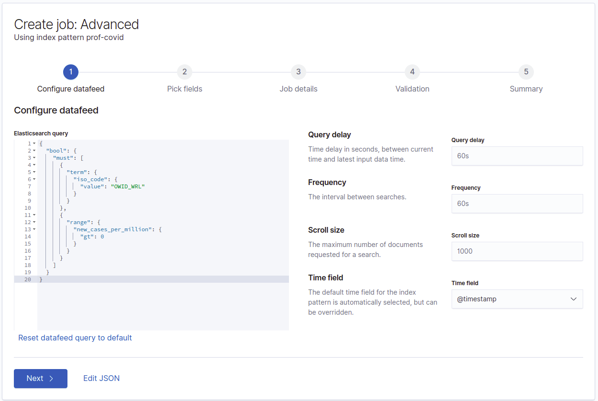

# Machine Learning (2h)

Maintenant que nous avons appris à créer des visualisations dans Kibana, nous allons nous pencher sur une partie plus complexe, le [machine learning](https://fr.wikipedia.org/wiki/Apprentissage_automatique).

> Il faut une licence pour utiliser le machine learning : nous allons donc activer la licence d'essai de Kibana, pour pouvoir utiliser le machine learning

## 1.1 ML dans Kibana

Il y à l'heure actuelle l'implémentation de **4 types** de machine learning:

**[Non supervisé](https://fr.wikipedia.org/wiki/Apprentissage_non_supervis%C3%A9)**:

- [Détection d'anomalie](https://fr.wikipedia.org/wiki/D%C3%A9tection_d%27anomalies): à partir d'une **série temporelle**, construit un modèle de probabilité et peut agir en temps réel pour **détecter des évènements inhabituels** se produisant. Le modèle peut **évoluer au fil du temps**.
    -  Il existe une variante, appelée **Outlier detection**, ne nécessitant pas de données temporelles, qui permet l'**identification de points inhabituels** dans un jeux de données en analysant la distance de chaque point **par rapport aux autres**, et la densité de chaque clusteur de point autour de lui.


**[Supervisé](https://fr.wikipedia.org/wiki/Apprentissage_supervis%C3%A9)**:

- [Classification](https://fr.wikipedia.org/wiki/Classement_automatique): apprend la **relation** entre les points de données pour être capable de **prédire des valeurs discrètes**
- [Regression](https://fr.wikipedia.org/wiki/R%C3%A9gression_(statistiques)): apprend la **relation** entre les points de données, afin de **prédire des valeurs numériques continues**

Dans Kibana, nous allons utiliser trois sous-types de machine learning différents:
- **Single metric**: détecte les anomalies dans une série temporelle
    - Par exemple, l'évolution du nombre de cas en France
- **Multi-metric**: détecte les anomalies avec une ou plusieurs métriques, et permets de séparer les données en fonction d'un champ
    - Par exemple, l'évolution du nombre de cas dans tous les pays
- **Population**: Détecte une activité qui parait inhabituelle par rapport au comportement du reste de la population
    - Par exemple, les anomalies d'évolutions des cas dans les différents pays
 
De manière générale, applicable quel que soit l'outil de machine learning : **plus nous disposons de données**, plus le modèle sera **précis**. 

## 1.2 Jeu de données

Dans ce TP, nous allons utiliser le jeu de donnée du TP précédent : les données **COVID** du monde.

Même s'il n'y a pas beaucoup de points temporels (1 par jour), sur ~2 ans, les données vont nous permettre de visualiser les variations (et voir même de prévoir) ce qui va se passer.

Néanmoins, avant de pouvoir utiliser le machine learning, il faut que les données soient le plus **propres** possible. En effet, à l'heure actuelle, avec le jeu brut:
-  les données contiennent deux types de données (les agrégats, comme pour le Monde; et les données pour chaque pays)
- certaines valeurs, comme le nombre de nouveaux cas, sont négatives, ce qui fausserait l'analyse

Nous allons donc utiliser **deux filtres** (et leurs variations) pour la création de ces modèles de machine learning, ce qui va nous permettre de **nettoyer** les données.

> Normalement, ce processus se fait en amont (avec Logstash par exemple)

### 1.2.1 Filtre sur une agrégation

> **Nous utiliserons ce filtre plus tard dans le TP**

Pour filtrer sur un seul pays / agrégation de données -> Changer la valeur de **iso_code** par ce qui est nécessaire

```json
{
  "bool": {
    "must": [
      {
        "term": {
          "iso_code": {
            "value": "OWID_WRL"
          }
        }
      },
      {
        "range": {
          "new_cases_per_million": {
            "gt": 0
          }
        }
      }
    ]
  }
}
```

### 1.2.1 Filtre pour exclure les agrégations

> **Nous utiliserons ce filtre plus tard dans le TP**

Supprime toutes les agrégations de données (monde, continent) de la recherche

```json
{
  "bool": {
    "must_not": [
      {
        "regexp": {
          "iso_code": {
            "value": "OWID.*"
          }
        }
      }
    ],
    "must": [
      {
        "range": {
          "new_cases_per_million": {
            "gt": 0
          }
        }
      }
    ]
  }
}
```

## 2.2 Exercices

### 2.2.1 Machine learning sur les nouveaux cas dans le monde

Nous allons essayer de voir s'il y a une **tendance**, que le machine learning d'Elasticsearch peut identifier, pour les **nouveaux cas** de COVID dans le monde.

#### Création du job

Dans la partie **Analytics**, **Machine Learning**, puis **Anomaly Detection**, nous allons créer un **nouveau job**.

Sélectionnons ensuite le bon index (`<groupeX>-covid`), et créer on job de type **Single metric**.

La création de ce type de job est décomposée en 5 étapes différentes:

1) Sélection de la plage de données
2) Sélection des champs
3) Ajout de métadonnées au job
4) Validation du job
5) Résumé du job

Pour notre premier exercice, cela va nous donner la configuration suivante:

**Sélection de la plage de données**

Nous voulons que le modèle soit construit en reprenant tout l'historique -> il faut cliquer sur "Use full prof-covid data"


**Sélection des champs**

C'est ici que nous allons définir nos métriques et champs. Dans notre cas, nous voulons utiliser la moyenne (mean) des nouveaux cas.

De plus, comme nous avons des **données journalières** (nous avons un évènement stocké par jour), il faut que nous mettions le **bucket span** à **1 jour** (estimate bucket span devrait également deviné cela). Cela signifie qu'il créera ses modèles en faisant des agrégations journalière, sur toute la période demandée.


**Ajout des métadonnées au job**

Ensuite, nous allons pouvoir mettre les **métadonnées** de notre job, comme son ID (qui doit être unique), une description, etc.


**Validation du job**

Si Elasticsearch trouve un **problème** dans le modèle de notre job, il sera affiché ici.


**Résumé du job**

Avant de pouvoir lancer le job, un **résumé** est affiché ici.

**Néanmoins**, comme nous devons **nettoyer et filtrer notre jeu de données**, afin qui ne se serve que des valeurs du monde, nous allons ajouter un filtre, en cliquant sur `Convert to advanced job`


**Query personnalisé pour requêter les données**

Cela va nous ramener à la première page, mais nous allons pouvoir **changer la query Elasticsearch**, ce qui va nous permettre, dans notre cas, de filtrer uniquement sur les **données mondiales**.

Une fois validé, et comme nous avons déjà tout renseigné, vous pouvez valider jusqu'à la dernière étape, **Jobs summary**, où vous pouvez maintenant **créer votre job**!



**Query personnalisé pour requêter les données**

Une fois le job créer, une dernière fenêtre nous demandant sur **quelle période** nous voulons **entrainer** le modèle apparait : nous allons laisser par défaut, car cela s'applique sur l'**intégralité des données**


#### Visualisation du résultat

Il va falloir **un petit peu de temps** pour voir le résultat (peu dans notre cas, car nous avons peu de données).

Sur le liste des jobs, nous allons pouvoir voir le résultat de notre job, en cliquant sur l'un des deux boutons suivants:


- Le premier va permettre de voir le résultat d'une seule série (pour l'instant, nous n'en avons qu'une)
- Le second permet d'avoir un affichage plus synthétique, lorsque nous avons plusieurs séries

Dans notre cas, cela nous donnera:

**Single metric viewer**

Nous pouvons voir ici, sur le graphique principal, deux choses:

- une ligne bleu foncé, représentant les **valeurs réelles** associées à notre métrique (les nouveaux cas de COVID)
- une zone bleu clair, qui correspond à la **zone de prédiction** de l'algorithme de machine learning. Dans notre cas, celles-ci est relativement **éloignée du réel** (la ligne devrait-être dans la zone claire), car les données cumulées sont très variables.

Sur le tableau du bas, on a une **liste des évènements avec des valeurs inhabituelles**, selon l'algorithme de détection d'anomalie. Plus la **sévérité** est grande, plus l'évènement est **inattendu**.


Néanmoins, l'une des fonctionnalités de cette vue est du pouvoir faire **des prédictions**, sur une période donnée, de ce que pourrais donné notre métrique (plus le modèle est proche des données, meilleur sera le résultat). En cliquant sur le bouton **Forecast**, et en mettant **7 jours**, nous allons obtenir cette courbe jaune, représentant la prédiction de l'algorithme:


**Anomaly explorer**

La vue **Anomaly Explorer** est beaucoup plus synthétique que la vue **Single Metric Viewer**, mais nous permet de voir le même résultat (vous pouvons changer de mode en cliquant sur l'une des deux icônes, en haut à gauche).


### 2.2.2 Exercices

> N'oubliez pas les filtres!

**Nouvelles morts causé par le COVID en France** *(jeu de donnée monde)*

- Réaliser, avec un **Single Metric**, un modèle basé sur le nombre de nouvelles morts, en France (le code ISO de la France est `FRA`)
- Refaites la même chose, mais en changeant le **bucket span** à **2 jours**

Questions:

- Quel modèle est le plus "sérré" ?
- Quel modèle est le plus précis ? Et pourquoi ?
- D'après l'algorithme d'apprentissage, les morts vont elles augmentés / diminuer, d'ici 1 semaine ?

**Nouveaux cas par pays** *(jeu de donnée monde)*

Réalisez, avec un **Multi-metric**, un modèle représentant l'évolution des nouveaux cas par pays (vous pouvez splitter soit sur `iso_code`, soit sur `location`)

Questions:

- Sur les 6 derniers mois, quel est le pays ayant eu une évolution anormale ? Pourquoi ?
- Et sur 12 mois ?

**Évolutions différentes par pays** *(jeu de donnée monde)*

À l'aide du job de **Population**, déterminer quel est le pays ayant eu une croissance anormale des cas, comparativement à sa taille de population *(new_cases_per_million)*

Questions:

- Le premier résultat, sur les 6 derniers mois, est-il valable ?
- Quelle caractéristique possèdent les premiers résultats (à votre avis) : pourquoi ceux-là et pas d'autres, telle que la France ou les États-Unis ?

**Impact de la région sur les cas de COVID en France** *(jeu de donnée France)*

(pas besoin de filtres)

En réutilisant le jeu de données sur la France (`<groupeX>-covid-france`), et en créant le modèle adapté, combien de pourcentage de départements (vous savez le nombre de département en france, et sont affichés dans le résultats seulement les départements considérés comme  anormaux) ont une croissance des hospitalisations anormales sur la dernière année ?
