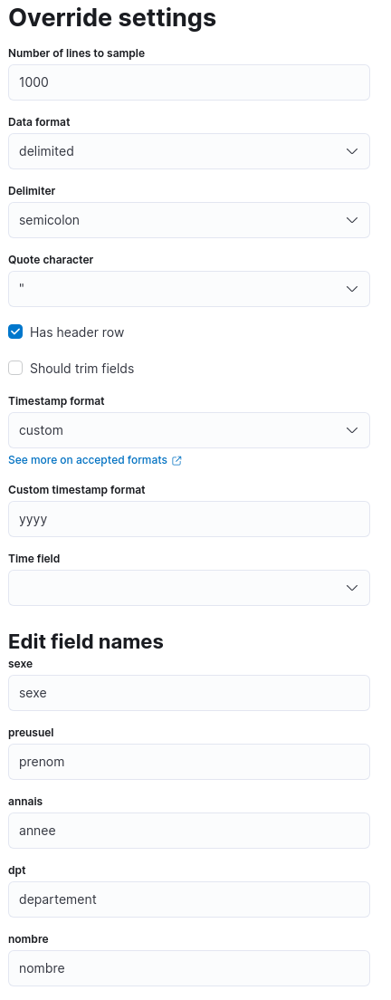
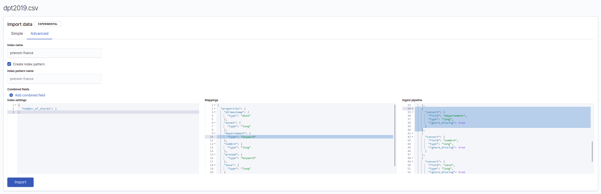
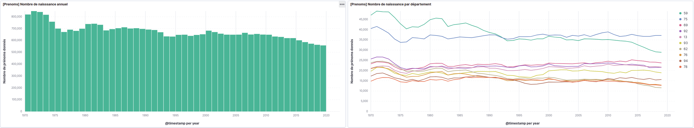
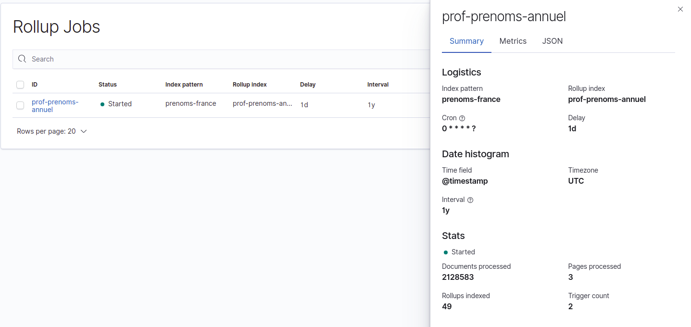
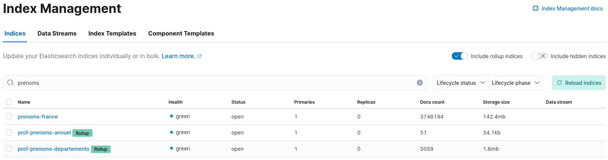

# Rollups (2h)

Maintenant que nous avons vu les bases de la visualisation de données, et l'utilisation du machine learning sur nos données, nous allons nous intéresser à une autre problématique, le stockage des données, ou plus précisément, comment réduire la volumétrie des données.

## 1. Contexte

Prenons un cas fictif.

> Vous avez **mis en place un clusteur Elasticsearch** pour stocker les logs d'une de vos applications, et celles-ci sont visualisables à travers Kibana. Vous stockez **les logs de celle-ci 1 mois**, et tout fonctionne bien. Néanmoins, votre chef souhaite que vous stockiez les **données 1 an**, pour que vous puissiez voir l'**évolution** dans le temps de celles-ci, ainsi que les impacts qu'ont eus les montées de version.

La problématique soulevée ici est toute simple : si vous avez la place, ce n'est pas un problème (x12 par rapport au besoin initial), mais si ce n'est pas le cas, à part accroître les disques ou augmenter le nombre d'instances ; vous êtes dans une impasse.

Il est **très rare** de devoir stocker les logs plus de 1 mois. En effet, à moins que ça soit justifié par des **contraintes légales**, le plus souvent, ce qui nous intéresse sont justes les **KPIs** affichés par Kibana.

Par défaut, avec Kibana, ils sont **calculés dynamiquement** (à partir des données brutes), comme une moyenne, ou une somme. Néanmoins, il est possible de faire autrement!

Dans Elasticsearch, il existe deux moyens d'agréger les données déjà existantes : avec des [transform](https://www.elastic.co/guide/en/elasticsearch/reference/7.17/transforms.html), et des [rollups](https://www.elastic.co/guide/en/elasticsearch/reference/7.17/xpack-rollup.html). C'est cette dernière méthode qui va nous intéresser ici.

Ci-dessous une traduction de leur [page de description](https://www.elastic.co/guide/en/elasticsearch/reference/7.17/xpack-rollup.html) de la fonctionnalité, très pertinente:

> Garder les données historiques pour réaliser des analyses est très utile, mais souvent évité à cause du haut coût de stockage (à cause de l'archivage de toutes ces données). Les périodes de rétentions sont alors définies pour des raisons financières, plutôt que par des raisons d'utilité des données.
> 
> La fonction Data Rollup fourni un moyen de résumé et stocker des données historiques, pour qu'elles puissent-être utiliser dans les analyses, mais à une fraction du coût de stockage des données brutes.

## 2. Cas concret

## 2.1 Jeux de données

Comme nous devons avoir un jeu de données relativement conséquent en taille, nous allons utiliser l'historique des prénoms en France, par département, de 1900 à 2021.

!> Pour les personnes utilisant le clusteur de BD71, aucun import des données n'est nécessaire, utiliser l'index `prenoms-france`, vous pouvez directement passer au point 2.2

Les données sont téléchargeables à cette adresse: https://www.insee.fr/fr/statistiques/fichier/7633685/dpt2022_csv.zip ([page d'origine](https://www.insee.fr/fr/statistiques/7633685?sommaire=7635552))

Téléchargez et dézippez le fichier zip, et vous devriez avoir un fichier CSV d'environ 80Mb.

> Il faudra environ 180Mo de disque libre sur le clusteur Elasticsearch, pour ceux ayant leur propre clusteurs

Ensuite, importer les données à l'aide du panel dans le machine learning (comme pour le TP précédent), et dans la partie **Override settings**, copié les paramètres ci-dessous:

Une fois valider, et passer à la page suivante, vous allez vous mettre en mode **Advanced**, et faire deux choses supplémentaires (le département est considéré comme un nombre, mais cela devrait-être une chaine). Comme sur l'image suivante:

Il faut:

- Changer le mapping du champ `departement` de **long** à **keyword** (partie surligné sur le bloc central)
- Supprimer de la partie **Ingest pipeline** le **convert du champs ``departement`` en ``long``** (partie surlignée sur le bloc de droite)

Une fois l'import lancé (**vous devriez avoir des erreurs**, dues à des erreurs dans le fichier d'origine), l'index pattern sera créer, et vous n'avez plus qu'à passer à l'étape suivante!

## 2.2 Structure du jeu de données

Si vous regardez les données sur **100 ans**, dans le discover (après avoir créer l'index pattern pour l'index `prenoms-france`), vous pouvez voir beaucoup de données (~ 3 millions).

Ce jeu de données contient les données **annuelles des prénoms donnés aux nouveau-nés, par départements**

Néanmoins, la **structure** de celles-ci est toute simple:

| Champ       | Signification                                                            |
|-------------|--------------------------------------------------------------------------|
| departement | Numéro du département                                                    |
| @timestamp  | Date (équivaut à l'année)                                                |
| sexe        | Sexe (1 = masculin, 2 = feminin)                                         |
| annee       | Année (sous forme de texte)                                              |
| prenom      | Prénom                                                                   |
| nombre      | Nombre de fois que le prénom à été donné dans ce département cette année |

C'est un bon exemple de ce que l'on peut trouver dans le monde de l'entreprise : des **données simples**, mais avec une **grosse volumétrie**

## 2.3 Réalisation d'une dashboard basique

Même si le jeu de données est très fortement axé sur les prénoms, les deux métriques qui vont nous intéresser sont:
- le nombre de naissances par an (=nombre de noms donnés)
- le nombre de naissances par département par an (nous ne voulons pas la catégorie *autres*)

Après avoir créé l'index pattern Kibana (pour `prenoms-france`), créer une dashboard contenant une visualisation des ces deux métriques.

> N'oubliez pas de changer l'interval de temps sur 100 ans!

Elle devrait ressembler à quelque chose comme ci-dessous :

Une fois faites, nous pouvons nous lancer dans la réduction des données! (Stack Management > Rollups Jobs > Create rollup job)

## 2.4 Créations des rollups jobs

Le processus de création d'un job rollups est décomposé en 6 phases:

- **Logistic**: Définition des index d'entrée, de sortie, de le fréquence d'actualisation du job
- **Date histogram**: Définition du champs date, et de la *période temporelle* d'agrégation des données
- **Terms**: Split en utilisant des valeurs textuelles de champs
- **Histogram**: Split en utilisant des histogrammes de nombres ou dates
- **Metrics**: Avoir des métriques pour chaque event (nombres)
- **Review and save**: Revoir la configuration, et lancer le job

Nous allons successivement **créer 2 rollups jobs** (un pour le nombre de naissances par an, un pour le nombre de naissances par département par an). Les paramètres sont les suivants:

- **Logistic**: -> (Changer name & rollup index name lors de la création du deuxième job par `groupeX-prenoms-departements` )
    - **name**: groupeX-prenoms-annuels
    - **index-pattern**: prenoms-france
    - **rollup index name**: groupeX-prenoms-annuels
    - **frequency**: every minute
    - **page size**: 1000
    - **latency buffer**: 1d
- **Date histogram**:
    - **date field**: @timestamp
    - **time bucket size**: 1y
    - **timezone**: UTC
- **Terms**:
    - pour le premier job, aucun
    - pour le second job, **departement**
- **Histogram**: Aucun
- **Metrics**:
    - champs **nombre**, les métriques `annee`, `nombre` et `sexe` 
- **Review and save**:
    - vérifiez que le cron job soit bien à `0 * * * * ?`, sinon reparter sur la partie logistic (cf. nb)
    - cocher "start job now", et sauvegarder le job!

Il vous faudra **attendre au maximum une minute** (frequency) pour que le job soit lancer, mais une fois démarrer, vous pourrez voir les progrès de celui-ci, en cliquant sur lui dans la liste des rollups jobs (en bas à droite):

Si le nombre de "Rollups indexed" est **différent de zéro**, et que les deux jobs sont créés, vous pouvez passer à l'étape suivante!

## 2.5 Créations de dashboard sur les données agrégées

Pour que vous puissiez **voir vos index** dans la partie index management, il ne faut pas oublier de cocher l'option **Include rollup indices**, comme sur la capture ci-dessous, car ils ne sont pas considérés comme des index *normaux*:

Il en est de même lorsque vous allez **créer vos deux index patterns**, il va falloir sélectionner **Rollup index pattern**, à la  place de **Standard index pattern**

Refaites les deux visualisations précédentes, en vous servant des **nouveaux index rollups**, et **intégrer les sur la dashboard** que vous avez créée, pour pouvoir comparer les deux (données brutes, et données rollups). Le résultat, données brutes vs données aggrégées, devrait-être quasiment identique.

> Il y a un bug sur la fonctionnalité, les données ne sont traitées qu'après 1970

**Questions**:

  - Est-ce que les données affichées sont les mêmes ?
  - Quel est le ratio des données stocké avant / après pour nos deux uses-cases ? En comparant la taille des indexs ?
  - Pourrions-nous nous passez d'un de nos deux index rollups, pour afficher les deux visualisations que vous avez créer à partir des données rollups ?
