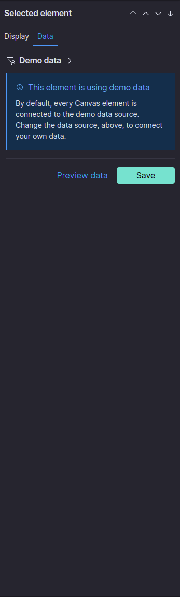
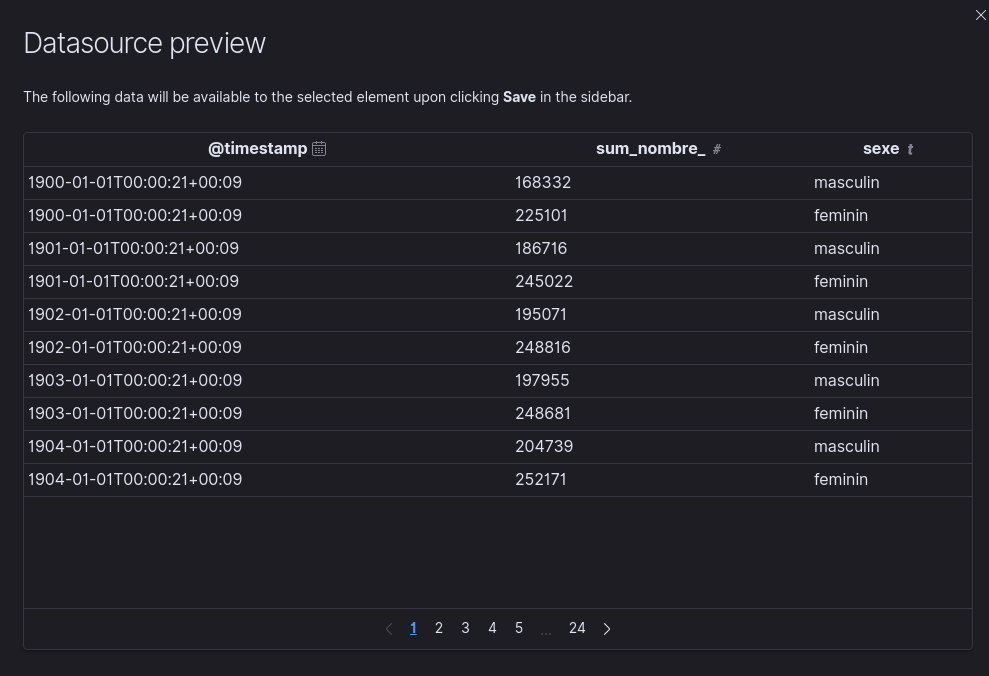
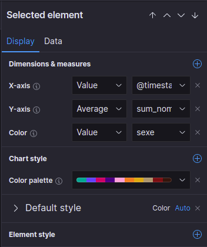
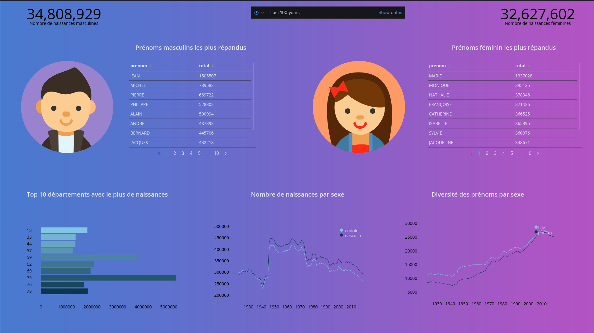

# Canvas (2h)

Après avoir vu toutes les bases de Kibana, nous allons nous intéresser à un dernier point, Canvas, qui va nous permettre de créer une sorte de **Présentation dynamique** synthétique des données

## 1.1 Utilité

Mêmes si les dashboard Kibana sont énormément utilisé, il existe, dans Kibana, un autre moyen de visualiser les données, de manière synthétique, nommé [Canvas](https://www.elastic.co/fr/what-is/kibana-canvas).

Il va permettre, contrairement aux dashboard, d'avoir une présentation beaucoup plus libre, et légère, permettant de bien mettre en valeurs les KPIs qui nous intéressent.

Ci-dessous des exemples de Canvas, réaliser dans Kibana ([source](https://www.elastic.co/fr/what-is/kibana-canvas)):


**Monitoring du hub d'un aeroport**:


**Ventes d'une entreprise par type d'habits**:


**Monitoring d'une infrastructure simple**:


**Suivi de la vente de café en temps réel**:


Tous ces example sont beaucoup plus séduisants que des dashboard, n'est-ce pas ? Quel est le piège, alors ?
- Les **Canvas** sont adaptès à afficher des informations simples, et n'entrent pas dans les détails
- Il est **impossible de filter** sur des valeurs dans un Canvas (mis à part à la construction de la dashboard)
- Les dashboard, comparitivement, sont **beaucoup plus simples à faire**. Elles sont conçu pour-être facilement créer, modifiable, et utilisable. Pour **Canvas**, seule sa facilité de compréhension et de récapitulation compte (et ça passe par le **design**, qui est un métier en soi).
- Génaralement, même si des exeptions existent, la **cible** de ces deux outils est **différente**:
    - Les **dashboard** sont utilisés par les **dev**, les **responsables des applications**, ... et vont permettre d'**entrer dans les détails**
    - Les **Canvas**, du fait de leur simplicité apparente, et de leur simplification extrème des données, sont plutôt utilisés par les chefs / la **hiérarchie**

Même si pour ces examples nous n'avons qu'une seule **page**, il est possible, comme un powerpoint, d'en avoir **plusieurs**, et de les faire changer automatiquement, **à un interval de temps donné**, comme un carrousel.

## 1.2 Interface

L'interface de Canvas (Analytics > Canvas) va se présenter comme ci-dessous:


Nous avons une **fenètre centrale** (dont nous pouvons configurer la taille, sur la droite), qui est notre *feuille de travail*, sur lequel nous allons pouvoir rajouter des compostants.

Si nous **ajoutons des composants**, nous en avons de trois types principaux:
    - Du **texte**, pour afficher des informations, comme un titre
    - Des **visualisations Canvas**, présent dans plusieurs catégories
    - Des **visualisations Kibana**, que nous utilisons par exemple dans les dashboard

Même s'il est possible d'utiliser des **visualisations classique**, c'est **fortement déconseillé**. En effet, les **visualisation Canvas sont par design minimaliste**, ce qui n'est pas le cas des visualisations classiques ; et le but de Canvas est d'afficher des informations de la manière la plus simplifié possible!

Si nous essayons d'ajouter **un graph de type ligne** (Chart > Lines), il va être **ajouté à la feuille de travail**, avec un jeu de données de démo. Pour changer celui-ci, sur la partie de droite, il nous faut aller dans la partie **Data**

A partir de là, pour selectionner notre source de donnée, le processus va être différent du processus classique que nous avons vu avec **Lens**, car les requêtes nous permettant de **récuperer les données** doivent-être fait en **SQL**.

Dans un premier temps, il va falloir changer la source de donnée par défaut, en cliquant sur "**Demo data**"



Ensuite, selectionner l'**Elasticsearch SQL**


Dans cette partie, c'est là que nous allons **définir la requête SQL**. Pour la tester à tout moment, nous pouvons cliquer sur **Preview data**, dont un exemple de résultat est afficher ci-dessous, et si le résultat semble correcte, nous allons pouvoir sauvegarder


Lorsque nous affichons la **preview**, le résultat (les données utilisable dans notre visualisation) seront affiché dans une table! Comme pour du SQL classique, plus nous récuperons de données, plus la query sera longue, il faut donc faire des requêtes optimisés au possible, afin de récuperer le moins de données que possible!



Une fois sauvegardé, dans la partie **Display**, nous avons accès aux options de **Canvas**, qui même si moins nombreuses, permettent de faire sensiblement la même chose que pour Lens.

> La principale différence est que le **split** de Lens est ici appelé **Color**



La **documentation** de **Canvas** est présent à la page [suivante](https://www.elastic.co/guide/en/kibana/current/canvas.html)

### 2.1 Création d'une dashboard sur les prénoms en France

En nous servans du jeu de donnée du TP précédant (avec l'index pattern `prenoms-france`), nous allons créer un canvas représentant au minimum les élèments suivants:

- Un selecteur de temps (par défaut, sur les 100 dernières années)

En terme de visualisations:

1) Total de naissance de garcon (une colonne, une ligne)
2) Total de naissance de filles (une colonne, une ligne)
3) 10 (au moins) prénoms masculins les plus répandus (deux colonnes, multiples lignes)
4) 10 (au moins) prénoms féminins les plus répandus (deux colonnes, multiples lignes)
5) 10 département avec le plus de naissances (deux colonnes, multiples lignes)
6) nombre de naissance par sexe (trois colonnes, multiples lignes)
7) diversité des colonnes par sexe (trois colonnes, multiples lignes)

> Toutes les **réquêtes SQL** sont faites et présentes dans la partie suivante!

### 2.2 Requêtes SQL à utiliser

**1) Total de naissances de garçons**

```sql
SELECT sum(nombre)
FROM "prenoms-france"
WHERE sexe=1
```

**2) Total de naissances de filles**

```sql
SELECT sum(nombre)
FROM "prenoms-france"
WHERE sexe=2
```

**3) 100 prénoms masculins les plus répandus**

```sql
SELECT prenom, sum(nombre) as total
FROM "prenoms-france"
WHERE sexe=1 and prenom != '_PRENOMS_RARES'
GROUP BY prenom
ORDER BY 2 DESC
LIMIT 100
```

**4) 100 prénoms féminins les plus répandus**

```sql
SELECT prenom, sum(nombre) as total
FROM "prenoms-france"
WHERE sexe=2 and prenom != '_PRENOMS_RARES'
GROUP BY prenom
ORDER BY 2 DESC
LIMIT 100
```

**5) Les 10 départements avec le plus de naissances**

```sql
SELECT sum(nombre) as total, departement
FROM "prenoms-france"
GROUP BY  departement
ORDER BY total desc
LIMIT 10
```

**6) Nombre de naissance par sexe**

```sql
SELECT "@timestamp", sum(nombre), CASE WHEN sexe = 1 THEN 'masculin' ELSE 'feminin' END as sexe
FROM "prenoms-france"
GROUP BY "@timestamp", sexe
```

**7) Diversité des prénoms par sexe**

```sql
SELECT "@timestamp", count(*) as total, CASE WHEN sexe = 1 THEN 'garcon' ELSE 'fille' END as sexe
FROM "prenoms-france"
GROUP BY "@timestamp", sexe
```

### 2.3 Exemple de Canvas

Ci-dessous un exemple de Canvas, que vous pouvez réaliser pour présenter ces données. (PS. je ne suis vraiment pas doué en graphismes). **Essayer de faire quelque chose de mieux**, en explorant toutes les fonctionnalitées de Canvas!



> Vous n'êtes pas obligé d'utiliser les mêmes types de visualisations, utiliser ce que vous pensez être le plus pertinent