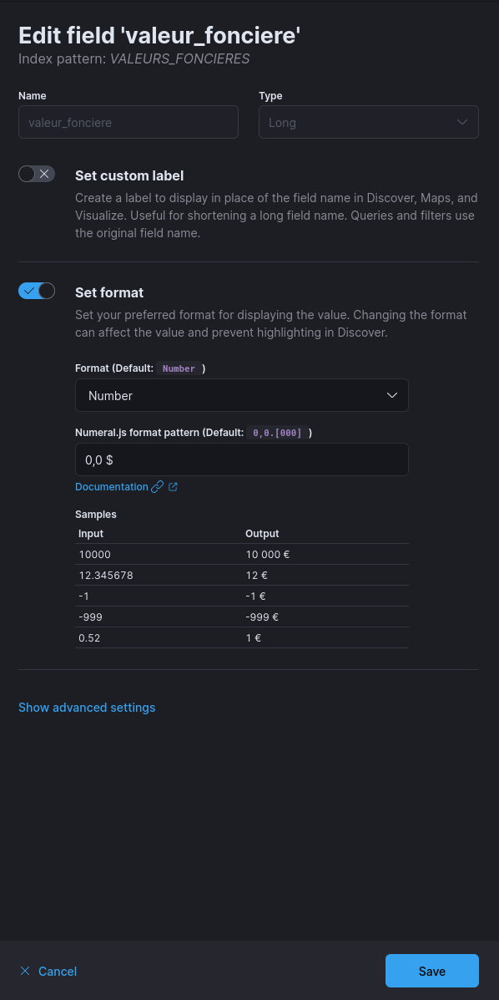
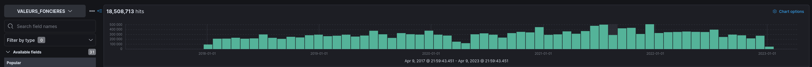
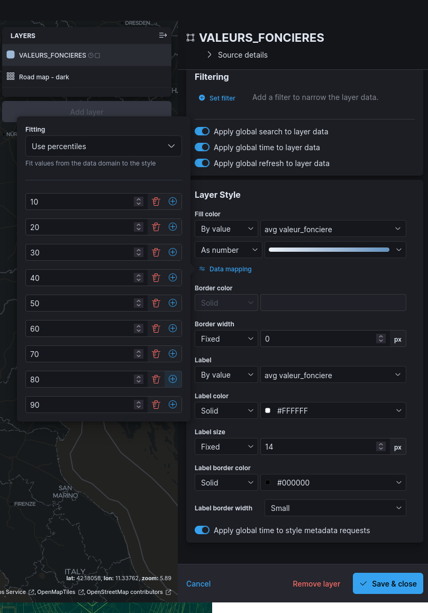

# Exploitation de données immobilières (~4h)

**Modalités**:
  - TP à effectuer en groupe, note commune aux personnes du groupe
  - Utiliser le Kibana dans le cloud: https://kibana.bd71.transrian.fr
  - Lisez le tp de bout en bout au début, et n'hésitez pas si vous avez des questions concernant la compréhension du TP
  - 7 jours pour le finir, jusqu'au 19 avril à minuit, 5 points retirés par jour de retard.
  - pour le rendu, m'envoyer un mail à valentin.bourdier@utbm.fr, avec les informations suivantes:
    - le groupe & les personnes le composant
    - un lien vers la dashboard
    - les réponses aux questions sous format PDF

## 1.1 Contexte

Vous travaillez pour un [fonds d'investissement immobilier](https://www.scpi-8.com/opci/definition-fpi) **Français**, et chercher à savoir s'il s'il est **rentable d'investir dans l'immobilier** en France.

On considèrera ici qu'il est intéressant de faire des achats si le **prix de vente augmente par rapport au prix d'achat**. Les **critères** à prendre en compte ici seront principalement le **nombre de pièces**, le **type de bien**, et **sa superficie**.

Pour ce faire, chaque groupe aura un **jeu de données légèrement différent**, avec les **ventes immobilières** effectués en France entre 2018 & 2022.

Nous nous intéresseront uniquement ici aux **maisons** et **appartements**, avec un prix et une surface raisonable (les filtres seront décrit plus-bas).

## 1.2 Donnée

Basé sur [ce jeu de données](https://www.data.gouv.fr/fr/datasets/demandes-de-valeurs-foncieres/)

| Nom du champ                 | Description                                                           | Type     | Example                           |
|------------------------------|-----------------------------------------------------------------------|----------|-----------------------------------|
| @timestamp                   | Date de la transaction                                                | Date     | 2022-03-05T00:00:00.000Z          |
| adresse.commune.altitude.max | Altitude maximum de la commune                                        | Nombre   | 71                                |
| adresse.commune.altitude.min | Altitude minimal de la commune                                        | Nombre   | 119                               |
| adresse.commune.code         | Code de la commune                                                    | Texte    | 252                               |
| adresse.commune.code_postal  | Code postal de la commune                                             | Texte    | 41500                             |
| adresse.commune.emplacement  | Localisation géographique (couple latitude / longitude) de la commune | GeoPoint | 1.46667, 47.6667                  |
| adresse.commune.nom          | Nom de la commune                                                     | Texte    | SUEVRES                           |
| adresse.complete             | Adresse complète de la commune                                        | Texte    | 23B RUE LES PIEZES, 41500 SUEVRES |
| adresse.departement.code     | Code du département                                                   | Texte    | 41                                |
| adresse.voie.code            | Code de la voie                                                       | Texte    | B232                              |
| adresse.voie.nom             | Nom de la voie                                                        | Texte    | LES PIEZES                        |
| adresse.voie.numero          | Numero de la voie                                                     | Texte    | 23                                |
| adresse.voie.numero_btq      | Numéro B/T/Q de la voie                                               | Texte    | B                                 |
| adresse.voie.type            | Type de la voie                                                       | Texte    | RUE                               |
| culture.nature               | Si non-vide, est utilisé pour les cultures                            | Texte    | T                                 |
| culture.nature_speciale      | Si spécificités du terrain agricole                                   | Texte    | ETANG                             |
| local.code_type              | Code du type de bien vendu                                            | Texte    | 1                                 |
| local.identifiant            | Identifiant du local                                                  | Texte    | 2                                 |
| local.type                   | Type de bien vendu                                                    | Texte    | Maison                            |
| nature_mutation              | Type de transaction                                                   | Texte    | Vente terrain à bâtir             |
| nombre_pieces_principales    | Nombre de pièces principales                                          | Nombre   | 5                                 |
| surface_reelle_bati          | Surface totale du bien (m2)                                           | Nombre   | 118                               |
| surface_terrain              | Surface du terrain du bien (m2)                                       | Nombre   | 228                               |
| valeur_fonciere              | Prix de vente (€)                                                     | Nombre   | 229000                            |
| prix_m2                      | Prix de vente relatif au mètre carré de bien (€)                                                     | Nombre   | 1128.65                            |

Un évènement correspond à une **transaction** (une vente).

De ce fait, pour avoir :

- le nombre de transaction, il faut utiliser un `count`
- la prix total des transaction, il faut utiliser une `sum`
- la prix moyen d'une transaction, il faut utiliser une `average` ou `median`

## 1.3 Import des données

Les données ont déjà été importés, vous n'avez rien à faire!

## 1.4 Création de l'index template

Créer votre index pattern dans Kibana, appelé `VALEURS_FONCIERES`, et modifier le format du champs `valeur_fonciere` comme suivant:

> Si le résultat est affiché en dollar, vous pouvez le modifier dans *Stack Management > Kibana > Advanced Settings*, en filtrant sur `Formatting locale`, et en changeant la langue local en **Français**

Faite de même pour **le champ** `prix_m2`.

Ensuite, dans le **Discover**, si vous regardez sur **six ans**, vous devriez voir des données:

> Comme chaque jeu de données est unique, vous n'aurez pas le même nombre d'évènements que sur cette capture d'écran, ni que vos camarades

## 2. TP

### 2.1 Dashboard (/10)

(0.6 point pour chaque, 1,6 points pour l'aspect esthétique & pratique pour l'utilisation de la dashboard)

Comme le jeux de données est (trop) complet, vous allez créer une **dashboard Kibana**, avec comme filtres globaux (au niveau de la dashboard):

- prix du bien entre 0 et 1.000.000 €
- surface du terrain entre 0 et 10.000 m2
- type de bien est soit "Appartement" ou "Maison"

> Lorsque vous mettez des **filtres** au niveau de la dashboard, ils ne sont **pas appliqués** lorsque vous créer / modifier des visualisations depuis celle-ci. Pour les appliquer, vous pouvez cliquer dessus, et mettre l'option **"Pin across all apps"**, ce qui signifie qu'elle seront transféré sur toutes les autres parties de Kibana, dont les visualisations. 

Ensuite, créer dans cette dashboards **des visualisations** permettant de représenter:

1) l'évolution du nombre de transaction au cours du temps
2) le nombre totale de transactions
3) le prix moyen (médianne) des biens vendus
4) le prix moyen (médianne) des biens vendus par type de bien
5) un tableau avec la moyenne des biens vendus & la moyenne du prix par m2, par département (100 premiers)
6) le nombre de ventes, au cours du temps, par type de bien
7) la moyenne (médianne) du prix des ventes, au cours du temps, par type de bien
8) Une carte représentant la moyenne du prix ventes
9) la répartition (pourcentage) des types de biens vendus
10) La répartition des ventes par nombre de pièces (top 10)
11) l'évolution du prix au m2 au cours du temps par type de bien
12) Le lien (abscisse / ordonnée) entre la surface totale & le nombre de transaction
13) Le lien (abscisse / ordonnée) entre l'altitude minimum de la ville & le prix des ventes (médianne)
14) Une Saved Search (sauvegarde du Discover), permettant de visualiser les données, avec pour colonnes:
    - La date
    - Le type de bien
    - L'adresse complète du bien
    - Le nombre de pièces principales
    - La surface du batiment
    - La surface du terrain
    - Le prix du bien
    - Le prix au m2

> La carte à réaliser n'est pas du même type que nous avons utiliser jusqu'à présent, vous pouvez utiliser `Clusters and Grids`, en mode `grid`, et en modifiant le `data mapping` des couleurs tel que suivant:

### 2.2 Machine learning (/2)

En utilisant le filtre suivant sur la requête pour chacun des jobs ML:

[resources/tp-final-2/ml_filtre.md](resources/tp-final-2/ml_filtre.md ':include')

Réalisez deux jobs de **machines learning** (utiliser l'interval de temps recommandé par le "Estimate time bucket", soit **2d**):

1) *(1pt)* Un **single** metric, concernant le **nombre** de transactions 
2) *(1pt)* Un **multi** métrique, concernant le **prix médian** et le **prix au m2** avec split par ***type de bien***

### 2.3 Questions (/8)

> A rendre sous format PDF, par mail

**Argumentez les réponses si nécessaire**, avec des captures d'écran et / ou une description de ce que vous avez fait pour obtenir le résultat

**Dashboard** *(/2)*:

Sur toute la période des données:

- *(1pt)* Pour la département du Rhône (69), quel type de bien à une évolution du prix au m2 le plus stable (=linéaire) ? Et pour quelle superficie environ (à plus ou moins 30m2 près) ce type de bien est-il le plus vendu ? 
- *(1pt)* Semblerait-il y avoir un lien entre le prix de vente d'un bien, et son altitude ? Si oui, comment l'expliqueriez-vous, en prenant du recul par rapport aux données seules, et en vous servant de vos connaissances ?

**Machine learning** *(/3)*:

- *(1pt)* D'après le résultat du job 1, semblerait-il y avoir, dans le futur, une baisse ou une augmentation de nombre de biens vendus à l'avenir ?
- *(1pt)* D'après le résultat du job 2, semblerait-il y avoir une fluctuation dans le prix des appartements ? Et pour les maisons ?
- *(1pt)* En corrélant les résultats du job 1 et 2 (forecast + observations), semblerait-il qu'on soit à un moment propice pour investir dans des achats immobiliers, début 2023 ?

**Question libre** *(/3)*: 

Qu'auriez-vous fait, si vous étiez investisseur dans l'immobilier, et vous aviez cette dashboard, et les jobs de machine learning configurés durant la période des données ? 
Si les données arrivaient en temps réels, auriez-vous investi, ou pas, et pourquoi ?

(= A un instant T, vous aviez accès à l'historique des ventes avant, mais pas après)

Et si vous n'aviez pas investi, mais que vous étiez-forcer de le faire, sur quel type(s) de bien(s) auriez-vous investi en priorité ? Avec quelles caractéristiques ? (Gardez en mémoire que le but est de faire de la plus-value sur le moyen/long terme).