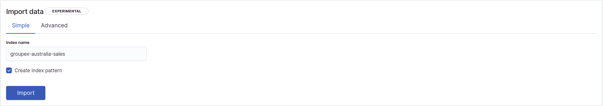

# Exploitation de données immobilières (~3h)

**Modalités**:
  - TP à effectuer en groupe
  - Utiliser le Kibana dans le cloud: https://bd71.transrian.fr:5601/

## 1.1 Contexte

Vous travaillez pour un [fonds d'investissemement immobilier](https://www.scpi-8.com/opci/definition-fpi) **Australien**, et vous cherchez à savoir s'il est **rentable d'investir dans l'immobilier** des 5 plus grandes villes Australiennes (Sydney, Perth, Adelaide, Brisbane & Canberra).

On considerrera ici qu'il est intéressant de faire des achats si le **prix de vente ne fait qu'augmenter**. Les **critères** à prendre en compte seront principalement le **nombre de pièces**, le **type de bien**, et **le quartier**.

Pour ce faire, chaque groupe aura un **jeu de données légèrement différent**, avec les **ventes immobilières** entre mi-2018 à mi-2020.

## 1.2 Données

Basé sur [ce jeu de données](https://www.kaggle.com/htagholdings/aus-real-estate-sales-march-2019-to-april-2020)

| Nom du champ    | Description                               | Exemple                             |
| --------------- | ----------------------------------------- | ----------------------------------- |
| `@timestamp`    | Date de l'évènement                       | Jul 16, 2020 @ 00&#58;00&#58;00.000 |
| `bedrooms`      | Nombre de pièces                          | 3                                   |
| `city_name`     | Nom de la ville                           | Adelaide                            |
| `date_sold`     | Quand à été vendu le bien (=~ @timestamp) | Jul 16, 2020 @ 02&#58;00&#58;00.000 |
| `location`      | Localisation géographique du bien         | -34.9005324,138.53064443            |
| `price`         | Prix du bien (peut-être nul  )            | 311000                              |
| `property_type` | Type de bien (house, unit or townhouse)   | unit                                |
| `suburb`        | Voisinage (quartier)                      | Findon                              |

## 1.3 Import des données

TODO

Pour **importer** le jeu de donnée **de votre groupe**, utiliser la fonctionnalitée **Import Data**, comme pour les TPs précédent, dans la partie Machine Learning > Data Visualizer.

Veuillez **nommer** votre **index** comme ceci: `<groupeX>-australia-sales` 

Sur la **seconde fenètre**, une fois les paramètres validés, cliqué sur **Advanced**, comme sur l'image suivante:

Et changer le **type** du champ `location` de **keyword** à **geo_point**, dans le cardre  appelé **Mappings**, comme sur l'image suivante:

> Vous ne devriez pas avoir d'erreurs d'insertion

## 1.4 Vérification de l'import des données

Une fois les données importées, allez vérifier dans les Index patterns Kibana si vos données sont bien typées:
    - les champs `bedrooms` & `price` devrait-être des **nombres**
    - le champ `location` devrait-être un **geo_point**

Comme sur l'image suivante:

De la même manière, dans le **Discover**, si vous regardez sur trois ans, vous devriez voir des données:

> Comme chaque jeu de données est unique, vous n'aurez pas le même nombre d'évènement que sur cette capture d'écran, ni que vos camarades

## 2. TP

### 2.1 Dashboard (/12)

(1 point pour chaque)

Réaliser une **dashboard Kibana**, permettant de visualiser:

1) le suivis des transactions, au cours du temps
2) le total des transactions (=ventes) effectués
3) la moyenne des transactions effectués
4) la répartition des types de biens vendus
5) le suivis des ventes, au cours du temps, par type de biens
6) le total des ventes, au cours du temps, par type de biens
7) Une carte, avec pour métrique le total des transactions, pour les zones couvertes en Australie
8) Une représentation du prix moyen des transaction, par ville & par quartier (sur la même visualisation)
9) L'évolution de la moyenne des transaction, par ville
10) La répartition des ventes par nombre de pièces
11) L'évolution du prix de vente, en fonction du nombre de pièces
12) Une saved search, permettant de visualiser les données, avec pour colonnes:
    - Date
    - Nom de la ville
    - Type
    - Quartier
    - Nombre de pièces
    - Prix

> La carte à réaliser n'est pas du même type que nous avons utiliser jusqu'à présent, vous pouvez utiliser `Heat Map`

### 2.2 Machine learning (/4)

Réalisez trois jobs de **machines learning**:

1) Un **single** metric, concernant le **nombre** de transaction
2) Un **single** metric, concernant le **prix moyen**
3) Un **multi** métrique, concernant le **prix moyen**, avec:
  - split par ville
  - avec pour influenceurs
    - ville
    - nombre de pièces
    - quartier
    - type de propriétés

### 2.4 Questions

TOFINNISH

Machine learning:

  - En correlant visualement avec le résultat du **job 1** et **job 2**, la baisse des prix fin décembre 2019 / début décembre 2019 vous semble-elle logique ? Pourquoi ?

  - D'après le résultat du **job 2**, si nous étions le 14 juin 2020:
    - serions nous dans une bonne période pour investir, et acheter un logement ?
    - a t'il existé dans le passé un période plus propice aux investissements ?

  - D'après le résultat du **job 3**, il semblerait qu'il y a eu beaucoup d'anomalies à Melbourne, au alentours de Décembre 2019. Quels sont les facteurs communs entre les anomalies les plus prononcées ?